# Multi-Tenant Ticketing System

# Application Flow
---
title: "Application Flow"
subtitle: "Multi-Tenant Ticketing System"
author: "Shreyas"
date: \today
---

# Application Flow

> Version: 1.0

---

# Table of Contents

1. Global Application Flow
2. Authentication Workflow
3. Platform Admin Workflows
4. Tenant Admin Workflows
5. Engineer Workflows
6. Client Workflows
7. Notification Workflow
8. Report Workflow
9. Settings Workflow
10. Logout Workflow

---

# 1. Global Application Flow

The following diagram represents the complete navigation entry point of the application before users enter their role-specific workspace.

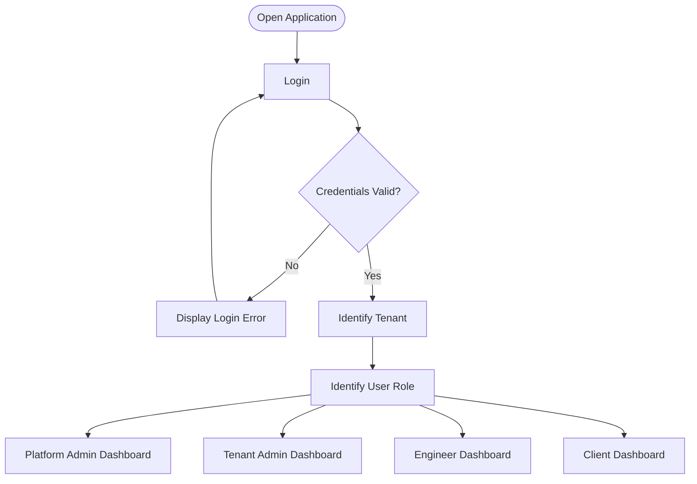

---

# 2. Authentication Workflow

## Login Workflow

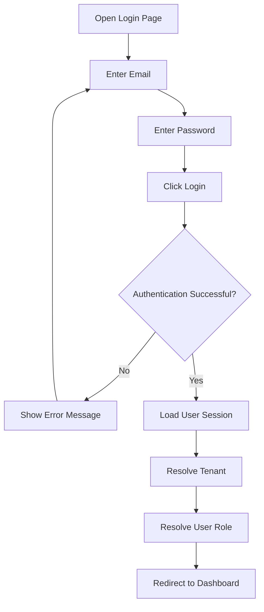

---

## Forgot Password Workflow

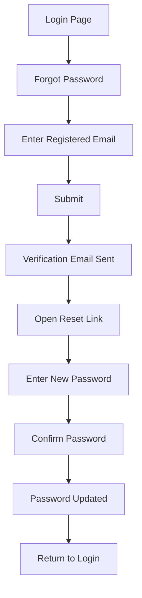

---

# 3. Platform Admin Workflows

## Manage Tenant

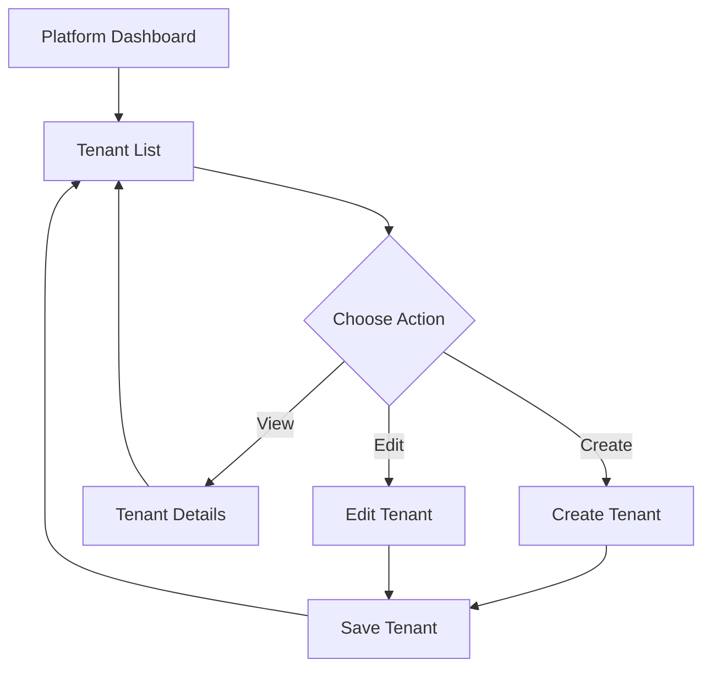

---

## View Platform Reports

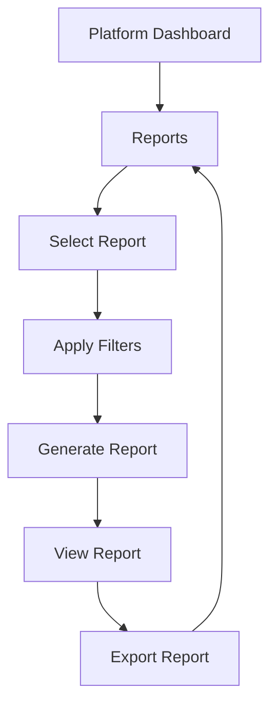

---

# 4. Tenant Admin Workflows

## Manage Users

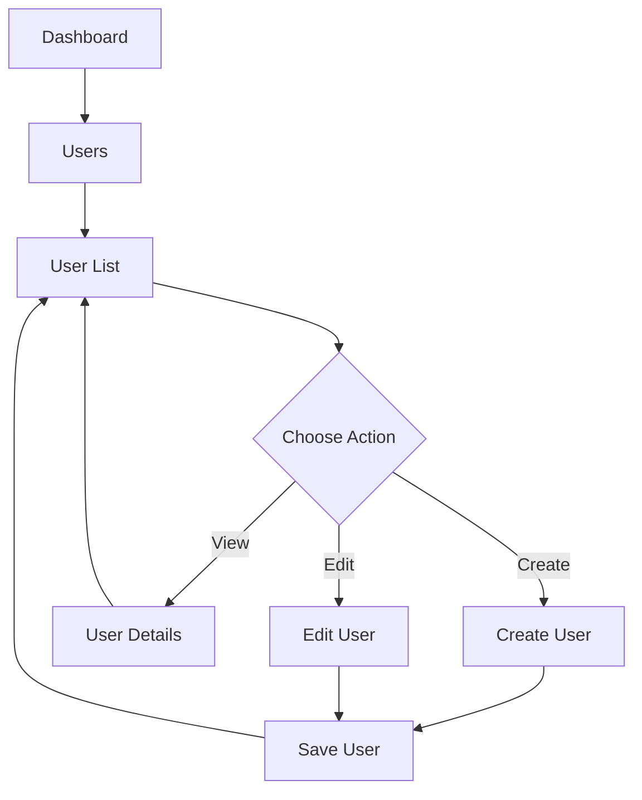

---

## Manage Clients

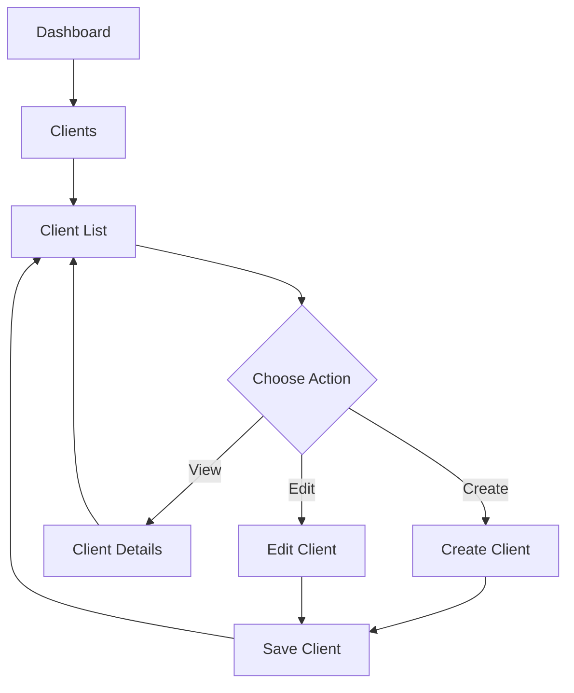

---

## Manage Projects

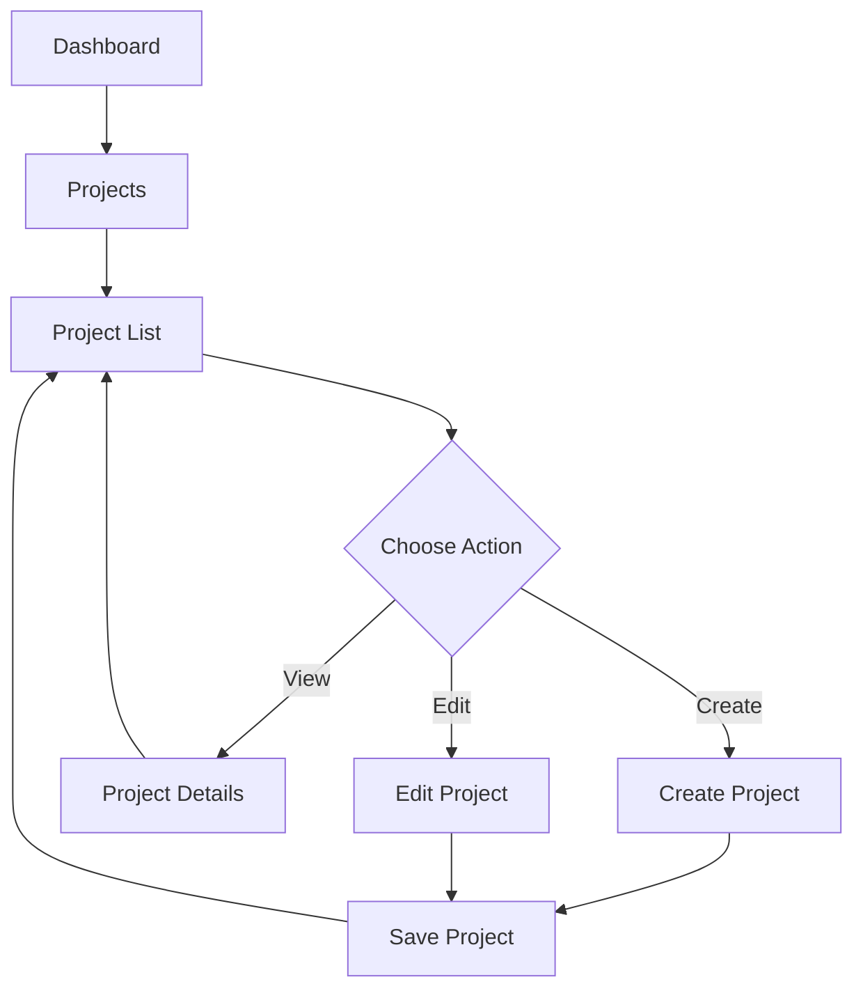

---
---

# 6. Engineer Workflows

## Daily Work Queue

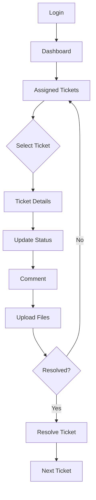

---

## Ticket Communication

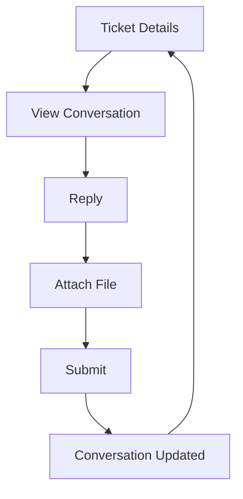

---

# 7. Client Workflows

## Raise Support Request

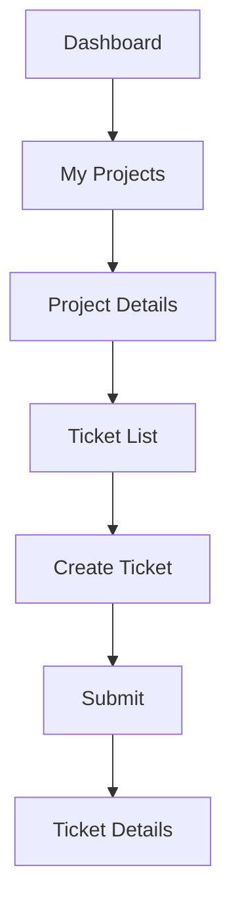

---

## Track Ticket Progress

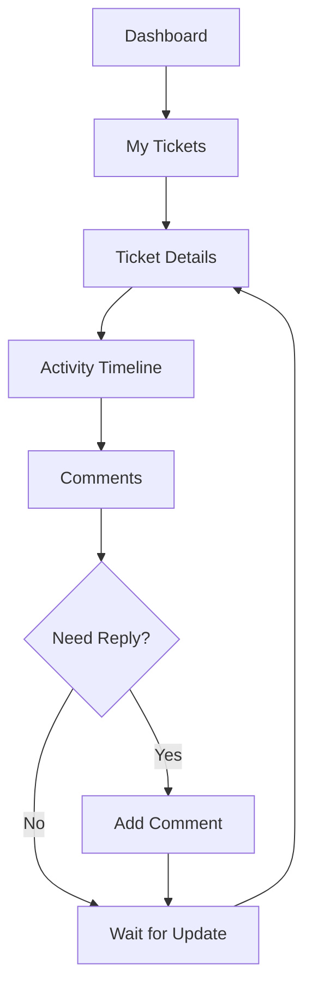

---

# 8. Notification Workflow

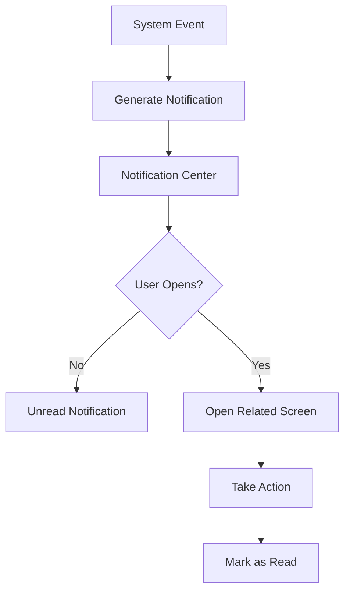

---

# 9. Report Workflow

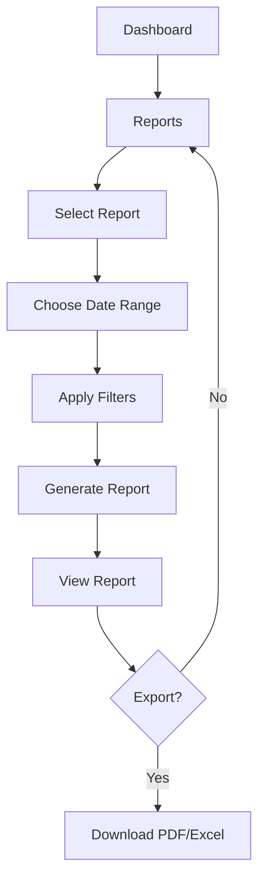

---

# 10. Settings Workflow

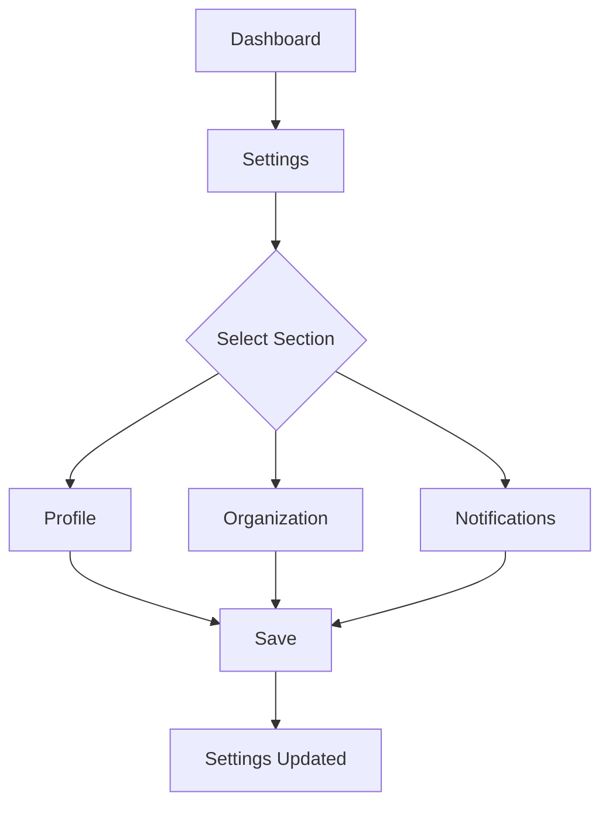

---

# 11. Logout Workflow

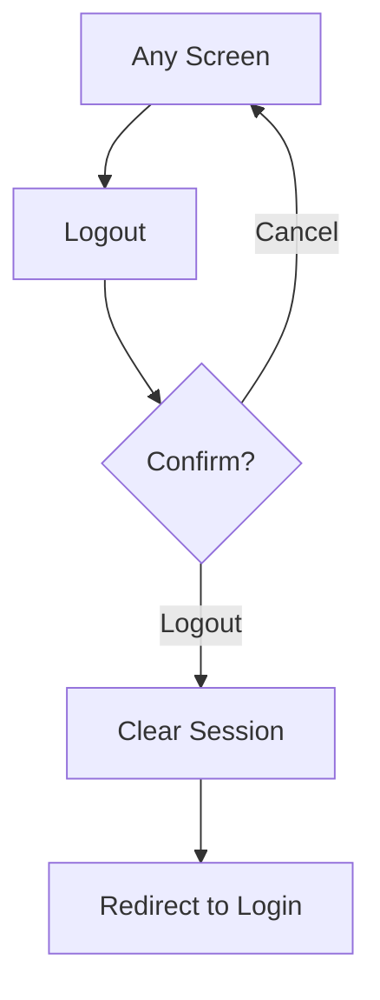

---

# 12. Complete User Experience

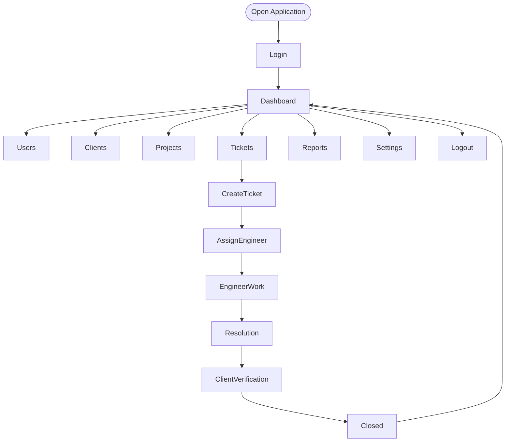
---

# 5. Ticket Management Workflows

The ticket management workflow represents the complete lifecycle of a support request from creation to closure.

## 5.1 End-to-End Ticket Journey

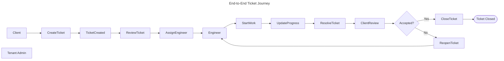

---

## 5.2 Create Ticket Workflow

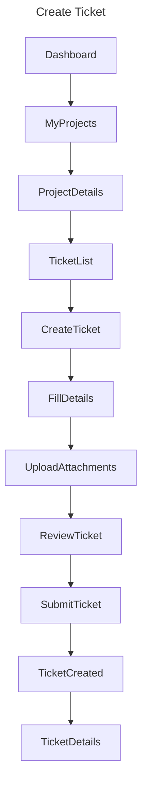

---

## 5.3 Ticket Assignment Workflow

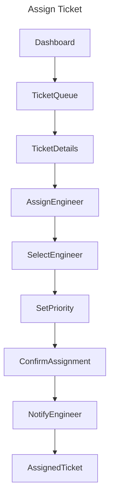

---

## 5.4 Engineer Resolution Workflow

```mermaid
---
title: Engineer Resolution
---

flowchart TD

AssignedTickets --> TicketDetails

TicketDetails --> ReviewIssue

ReviewIssue --> StartWork

StartWork --> UpdateStatus

UpdateStatus --> AddComment

AddComment --> Decision{Need More Work?}

Decision -->|Yes| ContinueWork

ContinueWork --> UpdateStatus

Decision -->|No| ResolveTicket

ResolveTicket --> NotifyClient
```

---

## 5.5 Client Verification Workflow

```mermaid
---
title: Client Verification
---

flowchart TD

Notification --> TicketDetails

TicketDetails --> ReviewResolution

ReviewResolution --> Decision{Issue Fixed?}

Decision -->|Yes| AcceptResolution

Decision -->|No| ReopenTicket

AcceptResolution --> CloseTicket

CloseTicket --> Dashboard

ReopenTicket --> AddComment

AddComment --> EngineerQueue
```

---

## 5.6 Ticket State Lifecycle

The canonical ticket status enum is:
`OPEN | IN_PROGRESS | WAITING_FOR_CLIENT | RESOLVED | CLOSED`

```mermaid
---
title: Ticket Lifecycle (Canonical 5-State Model)
---

stateDiagram-v2

[*] --> OPEN : Client creates ticket

OPEN --> IN_PROGRESS : Engineer assigned and starts work

IN_PROGRESS --> WAITING_FOR_CLIENT : Awaiting client response (SLA timer paused)

WAITING_FOR_CLIENT --> IN_PROGRESS : Client responds

IN_PROGRESS --> RESOLVED : Engineer marks resolved

RESOLVED --> CLOSED : Client accepts resolution

RESOLVED --> IN_PROGRESS : Client reopens (rejects resolution)

CLOSED --> [*]
```

> **Status notes:**
> - `Assigned` is not a distinct status — assignment is a field change on an `OPEN` ticket.
> - `ClientVerification` is a workflow phase, not a persisted status. It maps to the `RESOLVED` state.
> - Reopening a ticket transitions it back to `IN_PROGRESS`, not a separate `REOPENED` state.

---

# 6. Tenant Admin Workflows

The Tenant Admin is responsible for managing clients, projects, engineers, ticket assignments, SLAs, and monitoring operational health.

---

## 6.1 Tenant Admin Dashboard Navigation

```mermaid
---
title: Tenant Admin Navigation
---

flowchart LR

Dashboard --> Clients
Dashboard --> Projects
Dashboard --> Tickets
Dashboard --> Engineers
Dashboard --> Reports
Dashboard --> Settings
```

---

## 6.2 Client Onboarding Workflow

```mermaid
---
title: Client Onboarding
---

flowchart TD

ClientList --> CreateClient

CreateClient --> EnterClientInformation

EnterClientInformation --> SaveClient

SaveClient --> ClientProfile

ClientProfile --> CreateProject

CreateProject --> ProjectCreated
```

---

## 6.3 Project Setup Workflow

```mermaid
---
title: Project Setup
---

flowchart TD

Projects --> CreateProject

CreateProject --> ConfigureProject

ConfigureProject --> ConfigureSLA

ConfigureSLA --> AssignClient

AssignClient --> SaveProject

SaveProject --> ProjectDetails
```

---

## 6.4 Engineer Assignment Workflow

```mermaid
---
title: Engineer Assignment
---

flowchart TD

ProjectDetails --> TeamMembers

TeamMembers --> AssignEngineer

AssignEngineer --> SelectEngineer

SelectEngineer --> ConfirmAssignment

ConfirmAssignment --> EngineerAdded
```

---

## 6.5 SLA Monitoring Workflow

```mermaid
---
title: SLA Monitoring
---

flowchart TD

Dashboard --> SLAOverview

SLAOverview --> SelectTicket

SelectTicket --> ViewSLATimer

ViewSLATimer --> Decision{SLA Breached?}

Decision -->|No| Dashboard

Decision -->|Yes| EscalateTicket

EscalateTicket --> NotifyTenantAdmin
```

---

# 7. Engineer Workflows

Engineers primarily interact with assigned tickets and collaborate through comments and attachments.

---

## 7.1 Daily Work Queue

```mermaid
---
title: Engineer Daily Workflow
---

flowchart TD

Dashboard --> AssignedTickets

AssignedTickets --> SelectTicket

SelectTicket --> TicketDetails

TicketDetails --> StartWork

StartWork --> UpdateProgress

UpdateProgress --> ResolveTicket

ResolveTicket --> ReturnQueue

ReturnQueue --> AssignedTickets
```

---

## 7.2 Ticket Collaboration

```mermaid
---
title: Ticket Collaboration
---

flowchart TD

TicketDetails --> Conversation

Conversation --> AddComment

AddComment --> UploadAttachment

UploadAttachment --> SubmitUpdate

SubmitUpdate --> NotifyClient

NotifyClient --> Conversation
```

---

## 7.3 Reopened Ticket Workflow

```mermaid
---
title: Reopened Ticket
---

flowchart TD

ClientReopens --> Notification

Notification --> AssignedTickets

AssignedTickets --> TicketDetails

TicketDetails --> ReviewFeedback

ReviewFeedback --> ContinueWork

ContinueWork --> ResolveAgain

ResolveAgain --> ClientVerification
```

---

# 8. Client Workflows

Clients interact only with their own projects and support tickets.

---

## 8.1 Client Dashboard Navigation

```mermaid
---
title: Client Navigation
---

flowchart LR

Dashboard --> MyProjects

Dashboard --> MyTickets

Dashboard --> Notifications

Dashboard --> Settings
```

---

## 8.2 Project Support Workflow

```mermaid
---
title: Project Support
---

flowchart TD

MyProjects --> ProjectDetails

ProjectDetails --> TicketList

TicketList --> TicketDetails

TicketDetails --> AddComment

AddComment --> ViewUpdates

ViewUpdates --> TicketDetails
```

---

## 8.3 Ticket Tracking Workflow

```mermaid
---
title: Track Ticket
---

flowchart TD

Dashboard --> MyTickets

MyTickets --> TicketDetails

TicketDetails --> ActivityTimeline

ActivityTimeline --> Attachments

Attachments --> Comments

Comments --> TicketDetails
```

---

## 8.4 Resolution Verification Workflow

```mermaid
---
title: Verify Resolution
---

flowchart TD

Notification --> TicketDetails

TicketDetails --> ReviewResolution

ReviewResolution --> Decision{Satisfied?}

Decision -->|Yes| AcceptResolution

Decision -->|No| ReopenTicket

AcceptResolution --> TicketClosed

ReopenTicket --> SubmitFeedback
```
---

# 9. Notification Workflows

The notification system keeps all stakeholders informed about ticket updates, assignments, SLA events, and project activities.

---

## 9.1 Notification Center

```mermaid
---
title: Notification Center
---

flowchart TD

Dashboard --> NotificationCenter

NotificationCenter --> NotificationList

NotificationList --> OpenNotification

OpenNotification --> RelatedScreen

RelatedScreen --> MarkAsRead

MarkAsRead --> NotificationCenter
```

---

## 9.2 Ticket Update Notification

```mermaid
---
title: Ticket Update Notification
---

flowchart LR

EngineerUpdatesTicket

EngineerUpdatesTicket --> GenerateNotification

GenerateNotification --> NotifyClient

NotifyClient --> OpenTicket

OpenTicket --> TicketDetails
```

---

## 9.3 Ticket Assignment Notification

```mermaid
---
title: Engineer Assignment Notification
---

flowchart LR

AssignEngineer

AssignEngineer --> AssignmentNotification

AssignmentNotification --> EngineerDashboard

EngineerDashboard --> AssignedTickets
```

---

## 9.4 SLA Breach Notification

```mermaid
---
title: SLA Breach Notification
---

flowchart TD

SLATimer

SLATimer --> Decision{Breach?}

Decision -->|No| ContinueMonitoring

Decision -->|Yes| EscalationNotification

EscalationNotification --> TenantAdminDashboard
```

---

# 10. Search & Filter Workflows

Searching and filtering should be available wherever large datasets exist.

---

## 10.1 Global Search

```mermaid
---
title: Global Search
---

flowchart TD

Dashboard --> SearchBar

SearchBar --> EnterKeyword

EnterKeyword --> SearchResults

SearchResults --> Decision{Result Selected?}

Decision -->|Yes| DetailsPage

Decision -->|No| RefineSearch
```

---

## 10.2 Ticket Filtering

```mermaid
---
title: Ticket Filtering
---

flowchart TD

TicketList --> ApplyFilters

ApplyFilters --> Status

ApplyFilters --> Priority

ApplyFilters --> Engineer

ApplyFilters --> DateRange

Status --> FilteredResults
Priority --> FilteredResults
Engineer --> FilteredResults
DateRange --> FilteredResults

FilteredResults --> TicketDetails
```

---

# 11. Reports & Analytics

Reports help Tenant Admins monitor operational performance.

---

## 11.1 Generate Report

```mermaid
---
title: Generate Report
---

flowchart TD

Dashboard --> Reports

Reports --> SelectReport

SelectReport --> ApplyFilters

ApplyFilters --> GenerateReport

GenerateReport --> ReportPreview

ReportPreview --> ExportReport
```

---

## 11.2 Export Report

```mermaid
---
title: Export Report
---

flowchart TD

ReportPreview --> Export

Export --> Decision{Export Format}

Decision --> PDF

Decision --> Excel

PDF --> Download

Excel --> Download
```

---

# 12. Settings Workflows

---

## 12.1 Profile Settings

```mermaid
---
title: Profile Settings
---

flowchart TD

Dashboard --> Settings

Settings --> Profile

Profile --> EditProfile

EditProfile --> SaveChanges

SaveChanges --> UpdatedProfile
```

---

## 12.2 Notification Preferences

```mermaid
---
title: Notification Preferences
---

flowchart TD

Settings --> Notifications

Notifications --> ConfigurePreferences

ConfigurePreferences --> SavePreferences

SavePreferences --> PreferencesUpdated
```

---

# 13. Error & Exception Workflows

These workflows define common recovery paths across the application.

---

## 13.1 Unauthorized Access

```mermaid
---
title: Unauthorized Access
---

flowchart TD

ProtectedPage --> PermissionCheck

PermissionCheck --> Decision{Authorized?}

Decision -->|Yes| RequestedPage

Decision -->|No| AccessDenied

AccessDenied --> Dashboard
```

---

## 13.2 Session Expired

```mermaid
---
title: Session Expired
---

flowchart TD

UserAction --> SessionValidation

SessionValidation --> Decision{Session Valid?}

Decision -->|Yes| ContinueRequest

Decision -->|No| LoginPage

LoginPage --> Authenticate

Authenticate --> Dashboard
```

---

## 13.3 Empty State

```mermaid
---
title: Empty State
---

flowchart TD

OpenPage --> LoadData

LoadData --> Decision{Data Available?}

Decision -->|Yes| DisplayData

Decision -->|No| EmptyState

EmptyState --> PrimaryAction
```

---

# 14. Logout Workflow

```mermaid
---
title: Logout Workflow
---

flowchart TD

Dashboard --> Logout

Logout --> ConfirmLogout

ConfirmLogout --> Decision{Confirm?}

Decision -->|No| Dashboard

Decision -->|Yes| ClearSession

ClearSession --> LoginPage
```

---

# 15. Complete Application Navigation Map

```mermaid
---
title: Complete Application Navigation
---

flowchart LR

Login --> Dashboard

Dashboard --> Clients
Dashboard --> Projects
Dashboard --> Tickets
Dashboard --> Engineers
Dashboard --> Reports
Dashboard --> Notifications
Dashboard --> Settings

Projects --> TicketList

TicketList --> TicketDetails

TicketDetails --> Comments
TicketDetails --> Attachments
TicketDetails --> ActivityTimeline

Reports --> ReportPreview

Settings --> Profile

Settings --> NotificationPreferences

Dashboard --> Logout

Logout --> Login
```

---

# Appendix A - Primary User Journeys

| Role | Primary Journey |
|------|-----------------|
| Platform Admin | Login → Manage Tenants → Reports |
| Tenant Admin | Login → Dashboard → Projects → Tickets → Assign Engineer |
| Engineer | Login → Assigned Tickets → Resolve Ticket → Client Verification |
| Client | Login → Projects → Create Ticket → Track Ticket → Verify Resolution |

---

# Appendix B - Core Business Workflow

```mermaid
---
title: Core Business Workflow
---

flowchart LR

Client

Client --> CreateTicket

CreateTicket --> TenantAdmin

TenantAdmin --> AssignEngineer

AssignEngineer --> Engineer

Engineer --> ResolveTicket

ResolveTicket --> ClientReview

ClientReview --> Decision{Accepted?}

Decision -->|Yes| Closed

Decision -->|No| Reopened

Reopened --> Engineer
```

---
---

# 16. Screen Inventory

## Authentication

| Screen | Description | Next Screens |
|----------|-------------|--------------|
| Login | User authentication | Dashboard, Forgot Password |
| Forgot Password | Password recovery | Login |
| Reset Password | Create new password | Login |

---

## Dashboard

| Screen | Description | Next Screens |
|----------|-------------|--------------|
| Dashboard | Landing page after login | Clients, Projects, Tickets, Reports, Settings, Notifications |

---

## Client Module

| Screen | Description | Next Screens |
|----------|-------------|--------------|
| Client List | View all clients | Client Details, Create Client |
| Create Client | Add new client | Client Details |
| Client Details | Client overview | Edit Client, Projects |

---

## Project Module

| Screen | Description | Next Screens |
|----------|-------------|--------------|
| Project List | View projects | Project Details |
| Create Project | Create project | Project Details |
| Project Details | Project information | Ticket List |

---

## Ticket Module

| Screen | Description | Next Screens |
|----------|-------------|--------------|
| Ticket List | View tickets | Ticket Details, Create Ticket |
| Create Ticket | New support request | Ticket Details |
| Ticket Details | Ticket information | Comments, Attachments, Activity Timeline |

---

## Reports

| Screen | Description | Next Screens |
|----------|-------------|--------------|
| Reports | Analytics dashboard | Report Preview |
| Report Preview | Generated report | Export |

---

## Settings

| Screen | Description | Next Screens |
|----------|-------------|--------------|
| Settings | Application settings | Profile, Notifications |
| Profile | User profile | Settings |
| Notification Preferences | Configure alerts | Settings |

---

# 17. Route Hierarchy

```mermaid
---
title: Route Hierarchy
---

flowchart TD

Root["/"]

Root --> Login["/login"]

Login --> Dashboard["/dashboard"]

Dashboard --> Clients["/clients"]

Dashboard --> Projects["/projects"]

Dashboard --> Tickets["/tickets"]

Dashboard --> Reports["/reports"]

Dashboard --> Settings["/settings"]

Clients --> ClientDetails["/clients/:clientId"]

Projects --> ProjectDetails["/projects/:projectId"]

ProjectDetails --> TicketList["/projects/:projectId/tickets"]

TicketList --> TicketDetails["/tickets/:ticketId"]

Reports --> ReportDetails["/reports/:reportId"]

Settings --> Profile["/settings/profile"]

Settings --> Notifications["/settings/notifications"]
```

---

# 18. Navigation Principles

- Every page should have a consistent breadcrumb trail.
- Every detail page must provide a clear return path to its parent list.
- Long-running actions should provide progress indicators.
- Destructive actions require explicit confirmation.
- Permission checks occur before rendering protected screens.
- Deep links should resolve directly to the requested resource when authorized.

---

# 19. Global Navigation

```mermaid
---
title: Global Navigation
---

flowchart LR

Dashboard --> Clients
Dashboard --> Projects
Dashboard --> Tickets
Dashboard --> Reports
Dashboard --> Notifications
Dashboard --> Settings

Projects --> TicketList

TicketList --> TicketDetails

TicketDetails --> Comments
TicketDetails --> Attachments
TicketDetails --> ActivityTimeline

Reports --> ReportPreview

Settings --> Profile

Settings --> NotificationPreferences
```

---

# 20. Application Flow Summary

```mermaid
---
title: Complete User Journey
---

flowchart LR

Start([Open Application])

Start --> Login

Login --> Dashboard

Dashboard --> SelectModule

SelectModule --> Clients

SelectModule --> Projects

SelectModule --> Tickets

SelectModule --> Reports

SelectModule --> Settings

Projects --> TicketLifecycle

TicketLifecycle --> ClientVerification

ClientVerification --> Dashboard

Dashboard --> Logout

Logout --> End([Session Ended])
```

---
---

# 21. Role-Based Navigation Maps

## 21.1 Platform Admin Navigation

```mermaid
---
title: Platform Admin Navigation
---

flowchart LR

Login --> PlatformDashboard

PlatformDashboard --> Tenants

PlatformDashboard --> Reports

PlatformDashboard --> Settings

Tenants --> TenantDetails

TenantDetails --> EditTenant

Reports --> Analytics

Analytics --> Export
```

---

## 21.2 Tenant Admin Navigation

```mermaid
---
title: Tenant Admin Navigation
---

flowchart LR

Login --> Dashboard

Dashboard --> Clients

Dashboard --> Projects

Dashboard --> Tickets

Dashboard --> Engineers

Dashboard --> Reports

Dashboard --> Settings

Projects --> ProjectDetails

ProjectDetails --> TicketList

TicketList --> TicketDetails
```

---

## 21.3 Engineer Navigation

```mermaid
---
title: Engineer Navigation
---

flowchart LR

Login --> Dashboard

Dashboard --> AssignedTickets

AssignedTickets --> TicketDetails

TicketDetails --> Comments

TicketDetails --> Attachments

TicketDetails --> ResolveTicket
```

---

## 21.4 Client Navigation

```mermaid
---
title: Client Navigation
---

flowchart LR

Login --> Dashboard

Dashboard --> MyProjects

Dashboard --> MyTickets

Dashboard --> Notifications

Dashboard --> Settings

MyProjects --> ProjectDetails

ProjectDetails --> TicketList

TicketList --> TicketDetails
```

---

# 22. First-Time User Journeys

## 22.1 First Login Journey

```mermaid
---
title: First Login Journey
---

flowchart TD

Login --> Authenticate

Authenticate --> Dashboard

Dashboard --> WelcomeGuide

WelcomeGuide --> FirstAction

FirstAction --> ApplicationReady
```

---

## 22.2 New Client Onboarding

```mermaid
---
title: Client Onboarding Journey
---

flowchart TD

CreateClient

CreateClient --> ClientCreated

ClientCreated --> CreateProject

CreateProject --> ConfigureSLA

ConfigureSLA --> AssignEngineer

AssignEngineer --> ReadyForSupport
```

---

## 22.3 First Ticket Journey

```mermaid
---
title: First Ticket Journey
---

flowchart LR

Client

Client --> CreateTicket

CreateTicket --> Assignment

Assignment --> Engineer

Engineer --> Resolution

Resolution --> Verification

Verification --> Closed
```

---

# 23. Exception Flows

## 23.1 File Upload Failure

```mermaid
---
title: File Upload Failure
---

flowchart TD

UploadFile --> ValidateFile

ValidateFile --> Upload

Upload --> Decision{Upload Successful?}

Decision -->|Yes| AttachmentAdded

Decision -->|No| ShowError

ShowError --> RetryUpload
```

---

## 23.2 Network Failure

```mermaid
---
title: Network Failure
---

flowchart TD

UserAction --> SendRequest

SendRequest --> Decision{Network Available?}

Decision -->|Yes| ServerResponse

Decision -->|No| OfflineMessage

OfflineMessage --> Retry

Retry --> SendRequest
```

---

## 23.3 Permission Denied

```mermaid
---
title: Permission Denied
---

flowchart TD

Navigate --> PermissionCheck

PermissionCheck --> Decision{Authorized?}

Decision -->|Yes| RequestedPage

Decision -->|No| AccessDenied

AccessDenied --> Dashboard
```

---

## 23.4 Session Timeout

```mermaid
---
title: Session Timeout
---

flowchart TD

UserAction --> SessionValidation

SessionValidation --> Decision{Session Active?}

Decision -->|Yes| Continue

Decision -->|No| Login

Login --> Dashboard
```

---

# 24. Complete Support Lifecycle

```mermaid
---
title: Complete Support Lifecycle
---

flowchart LR

Client

Client --> CreateTicket

CreateTicket --> TenantAdmin

TenantAdmin --> Review

Review --> AssignEngineer

AssignEngineer --> Engineer

Engineer --> Investigation

Investigation --> Development

Development --> Testing

Testing --> Resolution

Resolution --> ClientReview

ClientReview --> Decision{Accepted?}

Decision -->|Yes| Closed

Decision -->|No| Reopened

Reopened --> Investigation
```

---

# 25. Application State Overview

```mermaid
---
title: Application Overview
---

flowchart TD

Start([Application])

Start --> Authentication

Authentication --> RoleSelection

RoleSelection --> PlatformAdmin

RoleSelection --> TenantAdmin

RoleSelection --> Engineer

RoleSelection --> Client

PlatformAdmin --> PlatformFeatures

TenantAdmin --> TenantFeatures

Engineer --> EngineerFeatures

Client --> ClientFeatures

PlatformFeatures --> Logout

TenantFeatures --> Logout

EngineerFeatures --> Logout

ClientFeatures --> Logout

Logout --> End([Session End])
```

---

# Revision History

| Version | Date | Description |
|----------|------|-------------|
| 1.0 | Initial Release | Production-ready application flow covering all primary workflows, role journeys, navigation maps, state transitions, and exception handling. |

---