# Multi-Tenant Ticketing System

# Software Architecture Document

**Version:** 1.0  
**Status:** Draft  
**Owner:** Engineering Team  
**Last Updated:** July 2026

---

# 1. Introduction

## 1.1 Purpose

This document describes the software architecture of the Multi-Tenant Ticketing System. It defines the system's architectural style, major components, interactions, design decisions, and quality attributes that guide the implementation.

The objective is to provide a shared technical understanding of the system architecture for developers, architects, testers, and other stakeholders.

---

## 1.2 Scope

This document covers the architecture of the complete application, including:

- Frontend architecture
- Backend architecture
- Multi-tenant architecture
- Data flow
- Authentication and authorization
- Core system modules
- Background processing
- File storage
- Security architecture
- Scalability considerations

Detailed database schemas, API specifications, deployment configurations, and implementation details are documented separately.

---

## 1.3 Architectural Goals

The architecture is designed to achieve the following objectives:

- Support multiple tenant organizations within a single platform.
- Ensure complete isolation of tenant data.
- Provide a modular and maintainable codebase.
- Support future scalability without major architectural changes.
- Deliver secure and reliable support ticket management.
- Enable independent evolution of business modules.
- Simplify testing, monitoring, and maintenance.

---

# 2. Architecture Overview

## 2.1 Architectural Style

The application follows a layered architecture that separates presentation, business logic, data access, and infrastructure concerns.

This separation ensures that business rules remain independent of framework-specific implementations while improving maintainability, testability, and long-term scalability.

The system is implemented as a modular monolith for the initial release. Each business capability is developed as an independent module with well-defined responsibilities, allowing future migration to microservices if required.

---

## 2.2 High-Level Architecture

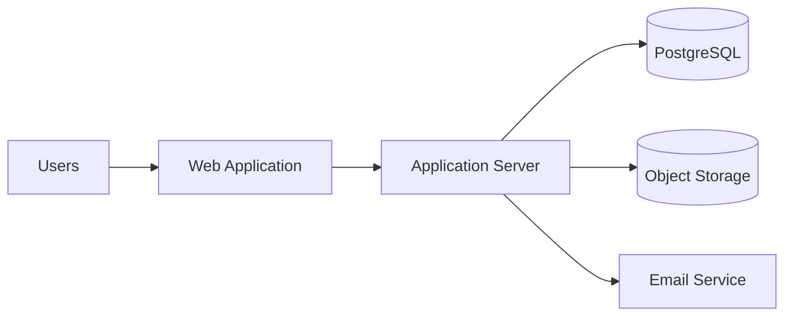

### Component Description

| Component          | Responsibility                                        |
| ------------------ | ----------------------------------------------------- |
| Web Application    | Provides the user interface for all platform users.   |
| Application Server | Processes business logic and coordinates all modules. |
| PostgreSQL         | Stores application data.                              |
| Object Storage     | Stores ticket attachments and uploaded files.         |
| Email Service      | Sends transactional notifications.                    |

---

## 2.3 Architectural Principles

The architecture is guided by the following principles:

### Separation of Concerns

Each layer has a single responsibility and communicates only through clearly defined interfaces.

### Modular Design

Business capabilities are organized into independent modules to reduce coupling and improve maintainability.

### Security by Design

Authentication, authorization, and tenant isolation are enforced throughout the application rather than treated as optional concerns.

### Scalability

The architecture supports horizontal scaling of stateless application servers while maintaining a shared data store.

### Maintainability

Modules are designed to be independently understandable, testable, and extensible.

### Reliability

Critical business operations are designed to preserve data consistency and support graceful failure handling.

---

# 3. Technology Stack

The Multi-Tenant Ticketing System is built using a modern web technology stack that emphasizes maintainability, scalability, developer productivity, and long-term extensibility.

| Layer          | Technology                    | Purpose                                    |
| -------------- | ----------------------------- | ------------------------------------------ |
| Frontend       | Next.js                       | Web application and user interface         |
| Language       | TypeScript                    | Type-safe application development          |
| Styling        | Tailwind CSS                  | Responsive and consistent UI styling       |
| UI Components  | shadcn/ui                     | Reusable and accessible UI components      |
| Backend        | Next.js Route Handlers        | API layer and business logic               |
| ORM            | Prisma ORM                    | Database access and schema management      |
| Database       | PostgreSQL                    | Primary relational database                |
| Authentication | JWT + HTTP-Only Cookies       | User authentication and session management |
| Validation     | Zod                           | Request validation                         |
| File Storage   | S3-Compatible Object Storage  | Ticket attachments                         |
| Email          | SMTP / Email Service Provider | Notification delivery                      |
| Logging        | Structured Application Logs   | Monitoring and troubleshooting             |

---

## 3.1 Technology Selection Rationale

### Next.js

Next.js provides both the frontend application and backend API capabilities within a unified framework, reducing operational complexity while enabling server-side rendering, client-side interactivity, and efficient routing.

---

### TypeScript

TypeScript improves code reliability through static type checking, reducing runtime errors and improving developer productivity for large-scale applications.

---

### PostgreSQL

PostgreSQL was selected for its reliability, transactional consistency, mature ecosystem, and strong support for complex relational data required by a ticketing platform.

---

### Prisma ORM

Prisma provides a type-safe database access layer, simplifying schema evolution, migrations, and application development while reducing the likelihood of database-related errors.

---

### JWT Authentication

JSON Web Tokens provide stateless authentication while HTTP-Only cookies protect authentication tokens from client-side JavaScript access.

---

### Object Storage

Attachments are stored outside the relational database to improve database performance, simplify backup strategies, and support efficient storage of large files.

---

# 4. System Context

The system serves four categories of users while integrating with external infrastructure services required for application operation.

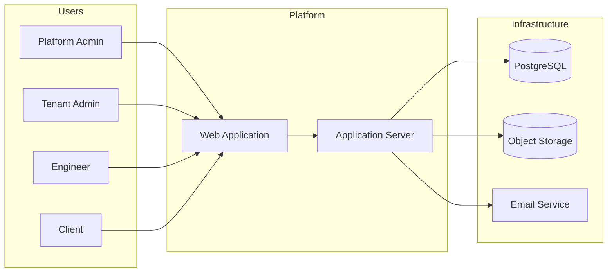

---

## 4.1 External Actors

### Platform Administrator

Manages tenant organizations and overall platform administration.

### Tenant Administrator

Manages users, clients, projects, tickets, and SLA policies within a tenant.

### Engineer

Works on assigned support tickets and collaborates with clients.

### Client

Creates and tracks support tickets related to their projects.

---

## 4.2 External Services

| Service        | Responsibility              |
| -------------- | --------------------------- |
| PostgreSQL     | Persistent application data |
| Object Storage | File attachments            |
| Email Service  | Transactional notifications |

---

## 4.3 Context Summary

All users interact with the platform through the web application.

Business requests are processed by the application server, which coordinates authentication, business logic, data persistence, file storage, and notification delivery.

The application server acts as the single entry point for all business operations, ensuring consistent enforcement of authentication, authorization, tenant isolation, and business rules.

# 5. High-Level Component Architecture

The application is organized into independent business modules. Each module owns a specific business capability and collaborates with other modules through well-defined interfaces.

This modular approach reduces coupling, improves maintainability, and allows individual modules to evolve independently without affecting the overall system architecture.

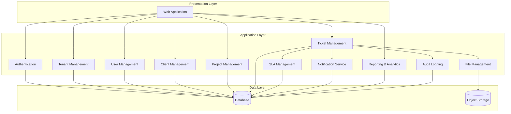

---

## 5.1 Component Responsibilities

| Component             | Responsibility                                         |
| --------------------- | ------------------------------------------------------ |
| Authentication        | Authenticates users and enforces authorization.        |
| Tenant Management     | Manages tenant organizations and tenant configuration. |
| User Management       | Manages tenant users and roles.                        |
| Client Management     | Manages client organizations.                          |
| Project Management    | Manages client projects and project configuration.     |
| Ticket Management     | Handles the complete support ticket lifecycle.         |
| SLA Management        | Tracks and evaluates SLA compliance.                   |
| Notification Service  | Delivers application and email notifications.          |
| Reporting & Analytics | Generates dashboards and operational reports.          |
| File Management       | Stores and retrieves ticket attachments.               |
| Audit Logging         | Records security and business events.                  |

---

## 5.2 Component Interaction Principles

The following principles govern communication between components:

### Single Responsibility

Each component is responsible for one business capability.

### Loose Coupling

Components communicate through well-defined interfaces and avoid direct dependencies wherever possible.

### Shared Business Rules

Business rules are enforced within the owning component to prevent duplication across the application.

### Centralized Security

Authentication and authorization are validated before business operations are executed.

### Shared Persistence

Business modules persist and retrieve data through the application's data access layer while maintaining tenant isolation.

---

## 5.3 Module Dependency Overview

The Ticket Management module acts as the central business module within the application.

It collaborates with:

- Authentication for user identity and authorization.
- Project Management to associate tickets with projects.
- Client Management to identify ticket ownership.
- SLA Management to evaluate service commitments.
- File Management to manage ticket attachments.
- Notification Service to inform users of ticket events.
- Audit Logging to record significant business activities.

This design keeps the Ticket module focused on ticket lifecycle management while delegating specialized responsibilities to dedicated components.

# 6. Multi-Tenant Architecture

## 6.1 Overview

The application follows a **shared application, shared database** multi-tenant architecture. All tenant organizations operate within the same application instance and database while maintaining complete logical isolation of their data.

Each tenant functions as an independent workspace with its own users, clients, projects, tickets, SLA policies, and reports. Users can access only the resources belonging to their assigned tenant.

This approach simplifies deployment, reduces infrastructure costs, and enables centralized platform management while supporting future scalability.

---

## 6.2 Tenant Isolation Model

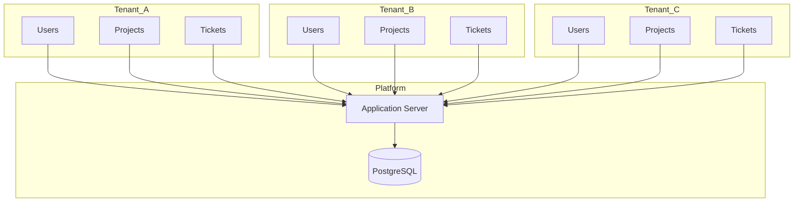

---

## 6.3 Tenant Context

Every authenticated request is associated with a single tenant context.

The tenant context is established during authentication and remains available throughout the request lifecycle. Business operations use this context to ensure that data access is restricted to the authenticated tenant.

No business operation shall access or modify resources belonging to another tenant.

---

## 6.4 Data Ownership

Every business entity belongs to exactly one tenant, either directly or through its parent relationship.

```text
Tenant
├── Users
├── Clients
│   ├── Projects
│   │   ├── Tickets
│   │   │   ├── Comments
│   │   │   ├── Attachments
│   │   │   └── Activity
│   └── SLA Policies
└── Reports
```

This ownership hierarchy provides a clear boundary for authorization, reporting, and data management.

---

## 6.5 Tenant Boundary

The following resources are isolated per tenant:

- Users
- Clients
- Projects
- Tickets
- Comments
- Attachments
- SLA Policies
- Notifications
- Reports
- Audit Logs

Platform-level configuration and tenant administration remain accessible only to Platform Administrators.

---

## 6.6 Tenant Request Flow

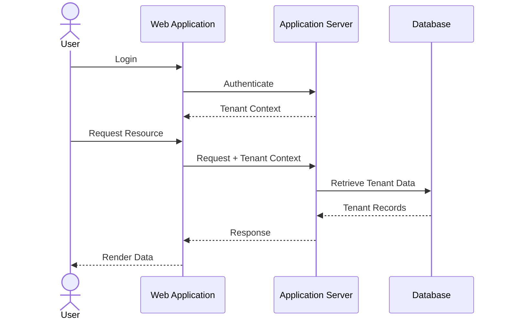

---

## 6.7 Benefits

The selected multi-tenant architecture provides the following advantages:

- Efficient infrastructure utilization.
- Centralized platform management.
- Simplified deployment and maintenance.
- Consistent feature availability across tenants.
- Support for onboarding new tenants without additional infrastructure.
- Logical isolation of tenant resources while sharing platform services.

---

## 6.8 Design Considerations

The architecture is designed with the following considerations:

- Every business request operates within a tenant context.
- Authorization is evaluated after tenant validation.
- Cross-tenant data access is prohibited.
- Tenant isolation is consistently enforced across all business modules.
- Shared platform services remain transparent to tenant users.

# 7. Frontend Architecture

## 7.1 Overview

The frontend is responsible for providing a responsive, secure, and intuitive user interface for all platform users. It communicates with the backend through authenticated API requests while enforcing a consistent user experience across all modules.

The frontend follows a feature-oriented architecture where business functionality is organized into independent modules rather than technical layers. This improves maintainability, scalability, and code ownership as the application grows.

---

## 7.2 Frontend Responsibilities

The frontend is responsible for:

- User authentication and session management
- Rendering application views
- User interaction and form handling
- Client-side validation
- API communication
- State management
- Navigation and routing
- Role-based UI rendering
- Error handling
- Notification display

Business rules and authorization decisions remain the responsibility of the backend.

---

## 7.3 High-Level Frontend Architecture

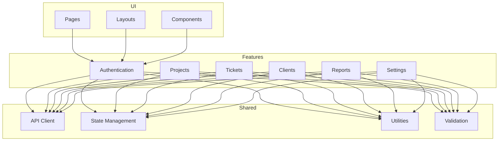

---

## 7.4 Architectural Principles

### Feature-Based Organization

Business functionality is organized into independent feature modules. Each module contains its own components, business logic, and API interactions.

This approach minimizes coupling and allows features to evolve independently.

---

### Component Reusability

Reusable UI components are centralized and shared across feature modules to maintain consistency while reducing duplication.

---

### Separation of Responsibilities

Presentation logic remains in UI components, while data retrieval and business interactions are delegated to feature modules and shared services.

---

### Consistent User Experience

Shared layouts, navigation, forms, dialogs, and feedback mechanisms provide a consistent experience throughout the application.

---

## 7.5 State Management

The frontend maintains application state at multiple levels.

| State Type     | Purpose                            |
| -------------- | ---------------------------------- |
| Authentication | Current user session               |
| UI State       | Dialogs, menus, loading indicators |
| Server State   | API responses and cached data      |
| Form State     | User input and validation          |

Business data remains the source of truth on the server.

---

## 7.6 API Communication

The frontend communicates exclusively with backend APIs.

All requests include the authenticated user context, and responses are validated before updating the user interface.

Communication follows a request-response model with centralized handling for:

- Authentication failures
- Authorization errors
- Validation errors
- Network failures
- Unexpected server errors

---

## 7.7 Navigation

Application navigation is role-aware.

Users are presented only with navigation items relevant to their assigned role.

Examples include:

- Platform Administration
- User Management
- Client Management
- Project Management
- Ticket Management
- Reports
- Settings

Unauthorized pages are inaccessible regardless of navigation visibility.

---

## 7.8 Security Considerations

The frontend contributes to application security by:

- Protecting authenticated routes
- Hiding unauthorized functionality
- Validating user input
- Preventing duplicate form submissions
- Displaying secure error messages

Final authorization decisions remain the responsibility of the backend.

---

## 7.9 Error Handling

Errors are categorized to provide appropriate feedback.

| Category       | Handling                                |
| -------------- | --------------------------------------- |
| Validation     | Display field-level validation messages |
| Authentication | Redirect to login when required         |
| Authorization  | Display access denied message           |
| Network        | Inform the user and allow retry         |
| Server         | Display generic error notification      |

Application errors are logged for operational monitoring.

# 8. Backend Architecture

## 8.1 Overview

The backend is responsible for enforcing business rules, processing client requests, managing application data, and coordinating communication between the system's core modules and external services.

The application follows a layered architecture that separates business logic from presentation, persistence, and infrastructure concerns. This separation improves maintainability, testability, and extensibility while reducing coupling between application components.

---

## 8.2 Backend Responsibilities

The backend is responsible for:

- Authentication and authorization
- Tenant isolation
- Business rule enforcement
- Ticket lifecycle management
- SLA tracking
- Notification processing
- File management
- Audit logging
- Reporting and analytics
- Data persistence

---

## 8.3 Layered Architecture

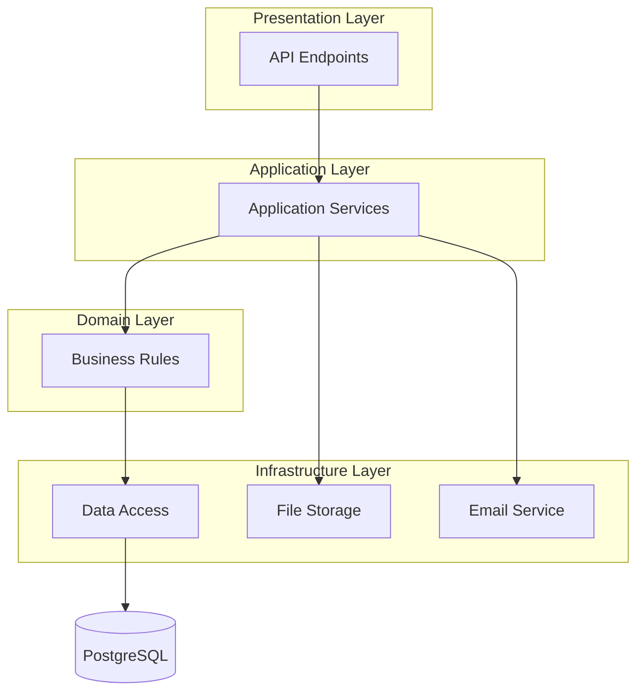

---

## 8.4 Layer Responsibilities

| Layer          | Responsibility                                          |
| -------------- | ------------------------------------------------------- |
| Presentation   | Accept requests, validate input, and return responses.  |
| Application    | Coordinate business operations and module interactions. |
| Domain         | Implement business rules and domain behavior.           |
| Infrastructure | Interact with databases and external services.          |

---

## 8.5 Request Processing Pipeline

Every incoming request follows a consistent processing pipeline before reaching business logic.

```mermaid
flowchart LR

Request["Request"]
Authentication["Authentication"]
Authorization["Authorization"]
TenantValidation["Tenant Validation"]
RequestValidation["Request Validation"]
BusinessLogic["Business Logic"]
Persistence["Persistence"]
Response["Response"]

Request --> Authentication
Authentication --> Authorization
Authorization --> TenantValidation
TenantValidation --> RequestValidation
RequestValidation --> BusinessLogic
BusinessLogic --> Persistence
Persistence --> Response
```

This pipeline ensures that every request is authenticated, authorized, validated, and executed within the correct tenant context.

---

## 8.6 Module Organization

The backend is organized into independent business modules.

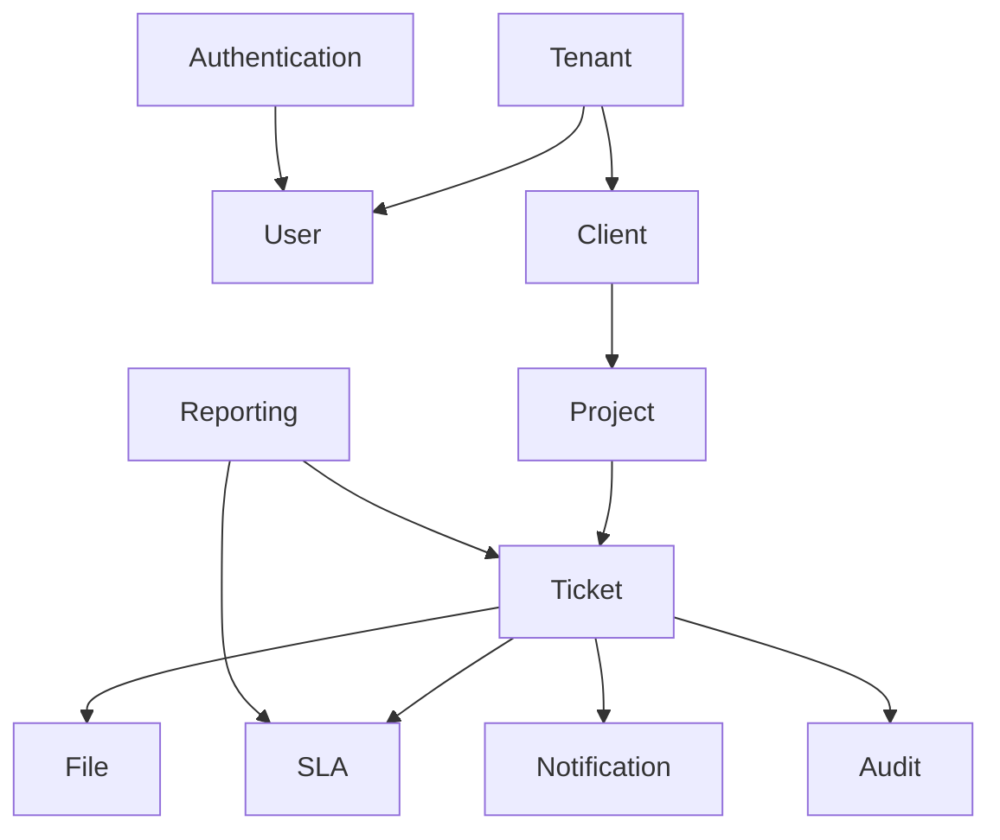

Each module owns its business rules and communicates with other modules through well-defined interfaces.

---

## 8.7 Module Interaction

Business modules collaborate while remaining independent.

Examples include:

- Ticket Management retrieves project information from the Project module.
- SLA Management evaluates ticket response and resolution targets.
- Notification Service publishes ticket-related notifications.
- Audit Logging records significant business events.
- Reporting aggregates operational data from multiple modules.

No module directly manipulates another module's internal state.

---

## 8.8 Data Access

All application data is accessed through a dedicated persistence layer.

Business modules do not communicate directly with the database. Instead, they interact through the application's data access layer, ensuring consistency, maintainability, and centralized data handling.

---

## 8.9 Error Handling

Errors are categorized and handled consistently across the application.

| Error Type     | Response                                           |
| -------------- | -------------------------------------------------- |
| Validation     | Reject invalid requests with descriptive messages. |
| Authentication | Reject unauthenticated requests.                   |
| Authorization  | Reject unauthorized operations.                    |
| Business Rule  | Prevent invalid business operations.               |
| System         | Log the error and return a generic response.       |

Sensitive implementation details shall never be exposed to end users.

---

## 8.10 Design Principles

The backend architecture follows these principles:

### Separation of Concerns

Each layer has a clearly defined responsibility.

### Single Responsibility

Each module owns a single business capability.

### Loose Coupling

Modules communicate through interfaces rather than implementation details.

### Security by Default

Authentication, authorization, and tenant isolation are enforced before business operations.

### Extensibility

New business modules can be introduced without requiring significant architectural changes.

### Testability

Business logic remains isolated from infrastructure concerns, enabling effective unit and integration testing.

# 9. Request Lifecycle

## 9.1 Overview

Every client request follows a consistent processing lifecycle from the moment it is received until a response is returned. This standardized pipeline ensures that authentication, authorization, validation, business rules, and tenant isolation are consistently enforced across the application.

While individual business operations differ, they all follow the same architectural pattern.

---

## 9.2 Standard Request Lifecycle

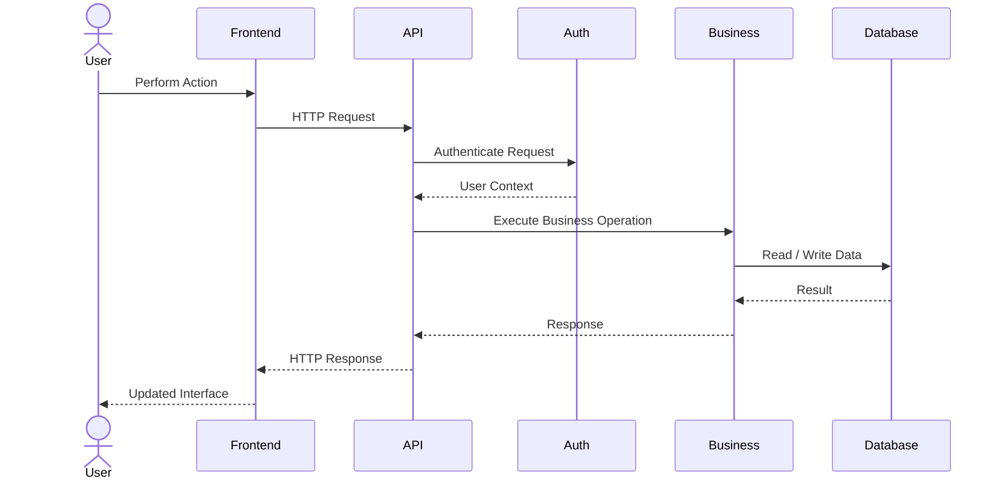

---

## 9.3 Request Processing Pipeline

Every request passes through the following stages:

1. Request Reception
2. Authentication
3. Authorization
4. Tenant Validation
5. Request Validation
6. Business Processing
7. Data Persistence
8. Response Generation

Each stage is responsible for validating or enriching the request before passing it to the next stage.

---

## 9.4 Ticket Creation Flow

The following sequence illustrates the creation of a new support ticket.

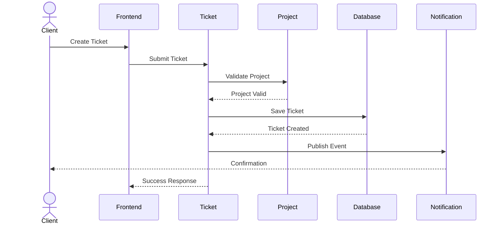

---

## 9.5 Ticket Assignment Flow

The following sequence illustrates ticket assignment by a Tenant Administrator.

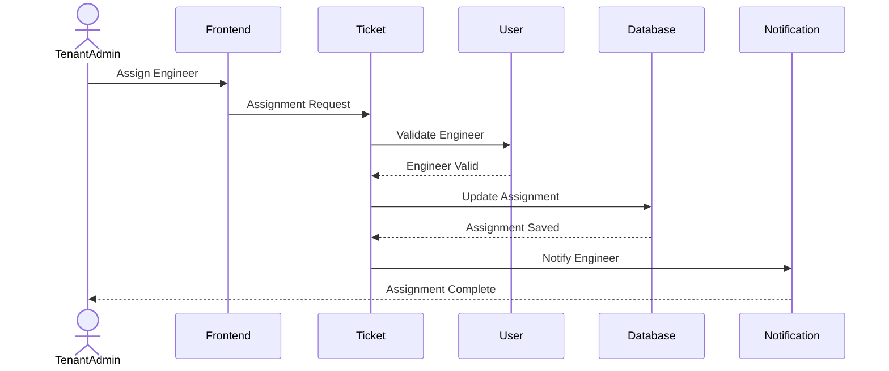

---

## 9.6 Ticket Status Update Flow

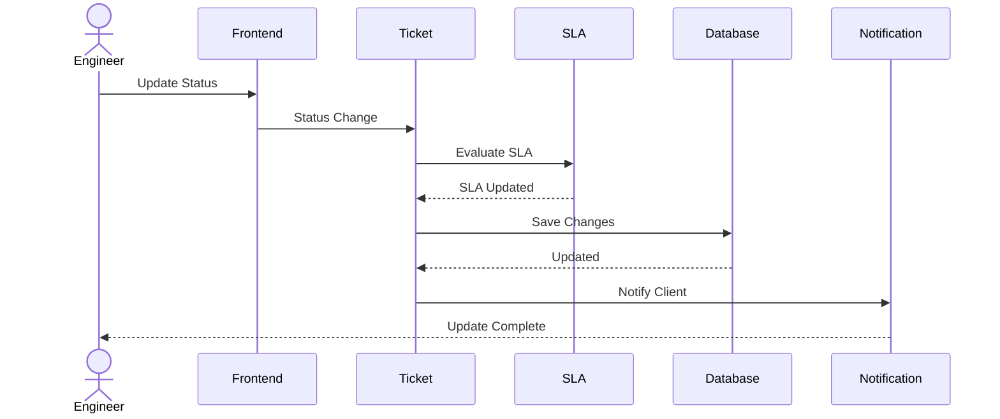

---

## 9.7 Attachment Upload Flow

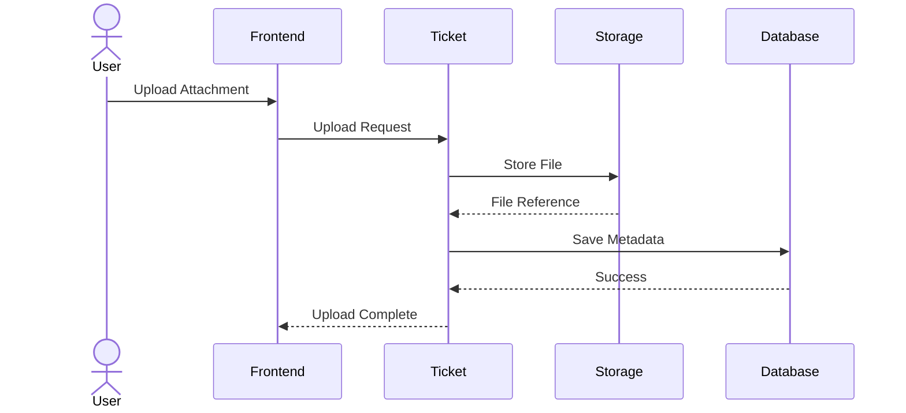

---

## 9.8 Architectural Characteristics

All business requests follow the same architectural principles:

- Requests are authenticated before processing.
- Authorization is validated before business operations.
- Tenant boundaries are enforced for every request.
- Business rules are evaluated before data persistence.
- Significant events are recorded for auditing.
- Notifications are generated when required.
- Responses are returned only after successful completion of the business operation.

These principles ensure consistent behavior across all application modules while maintaining security, reliability, and data integrity.

# 10. Security Architecture

## 10.1 Overview

Security is implemented as a cross-cutting architectural concern that applies to every application layer. The system follows a **defense-in-depth** strategy, where multiple security mechanisms work together to protect application resources, tenant data, and user identities.

Security controls are enforced throughout the request lifecycle rather than relying on a single protection mechanism.

---

## 10.2 Security Layers

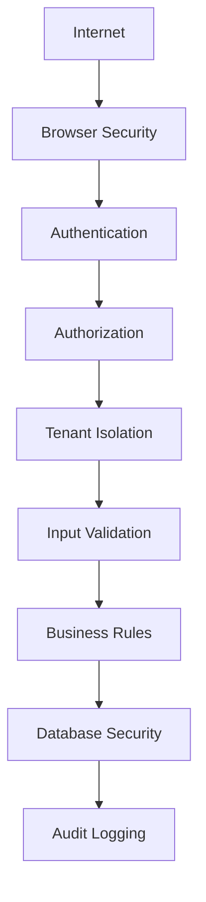

Each layer provides an independent security boundary, ensuring that a failure in one layer does not compromise the entire application.

---

## 10.3 Authentication

Authentication verifies the identity of every user before access to protected resources is granted.

The authentication process establishes:

- User identity
- Tenant context
- Assigned role
- Session information

Unauthenticated requests are rejected before business processing begins.

---

## 10.4 Authentication Flow

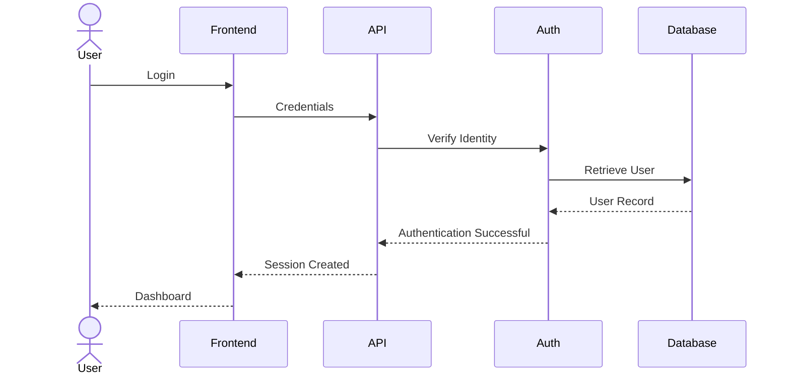

---

## 10.5 Authorization (RBAC)

After authentication, every request is evaluated against the user's assigned role and permissions.

Authorization determines whether a user is permitted to perform a requested operation.

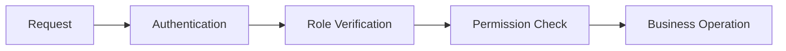

The backend performs authorization for every protected request regardless of frontend visibility.

---

## 10.6 Tenant Isolation

Tenant isolation prevents users from accessing resources belonging to other organizations.

Every request is executed within a validated tenant context.

Authorization decisions consider both:

- User permissions
- Tenant ownership

Cross-tenant access is prohibited unless explicitly permitted for platform administration.

---

## 10.7 Session Management

Authenticated sessions are managed securely to reduce the risk of unauthorized access.

The system shall:

- Use secure session tokens.
- Support session expiration.
- Invalidate sessions after logout.
- Reject expired sessions.
- Protect session data during transmission.

---

## 10.8 Input Validation

All external input is treated as untrusted.

Validation occurs before business processing and includes:

- Required fields
- Data type validation
- Length constraints
- Format validation
- Business rule validation

Invalid requests are rejected before reaching the domain layer.

---

## 10.9 File Upload Security

Uploaded files are validated before being accepted by the system.

Validation includes:

- File type verification
- File size limits
- Filename sanitization
- Malware scanning (where supported)
- Storage outside the application runtime

Executable files and unsupported formats are rejected.

---

## 10.10 Data Protection

Sensitive business information is protected throughout its lifecycle.

The system protects:

- User credentials
- Authentication tokens
- Personally identifiable information
- Ticket attachments
- Audit records

Sensitive data shall never be exposed through application errors or logs.

---

## 10.11 Secure Communication

Communication between clients and the application shall use encrypted transport.

Security measures include:

- HTTPS
- Secure cookies
- Transport encryption
- Protection against session interception

---

## 10.12 Security Headers

The application should apply appropriate HTTP security headers to reduce common web-based attacks.

Recommended headers include:

- Content Security Policy (CSP)
- X-Frame-Options
- X-Content-Type-Options
- Referrer-Policy
- Permissions-Policy
- Strict-Transport-Security (HSTS)

---

## 10.13 Rate Limiting

Rate limiting protects the application from abuse and excessive request volumes.

Rate limiting may be applied to:

- Login requests
- Password reset requests
- File uploads
- Public APIs
- Ticket creation
- Search operations

Limits should be configurable according to operational requirements.

---

## 10.14 Audit Logging

Security-sensitive operations are recorded for accountability and forensic analysis.

Examples include:

- User login
- Failed login attempts
- Role changes
- Permission updates
- Ticket assignment
- Ticket deletion
- SLA policy modifications
- User creation
- Tenant configuration changes

Audit records are immutable and available only to authorized users.

---

## 10.15 Security Principles

The security architecture follows the following principles:

### Defense in Depth

Multiple independent security controls protect application resources.

### Least Privilege

Users receive only the permissions necessary to perform their responsibilities.

### Fail Secure

When a security decision cannot be made, access is denied by default.

### Zero Trust

Every request is authenticated, authorized, and validated regardless of its origin.

### Complete Mediation

Every protected resource access is verified before execution.

### Secure by Default

Security mechanisms are enabled by default rather than being optional.

---

## 10.16 Security Summary

The security architecture integrates authentication, authorization, tenant isolation, validation, secure communication, audit logging, and operational protections into a unified security model.

By enforcing security controls consistently across every request, the platform protects tenant data while supporting secure and scalable multi-tenant operation.

# 11. Data Architecture

## 11.1 Overview

The application uses a relational data model to represent tenants, users, clients, projects, tickets, and supporting business entities.

The data architecture is designed to maintain strong consistency, preserve tenant isolation, support transactional operations, and enable efficient reporting while accommodating future growth.

Every business entity is associated with a tenant either directly or through its parent relationship.

---

## 11.2 Data Architecture Overview

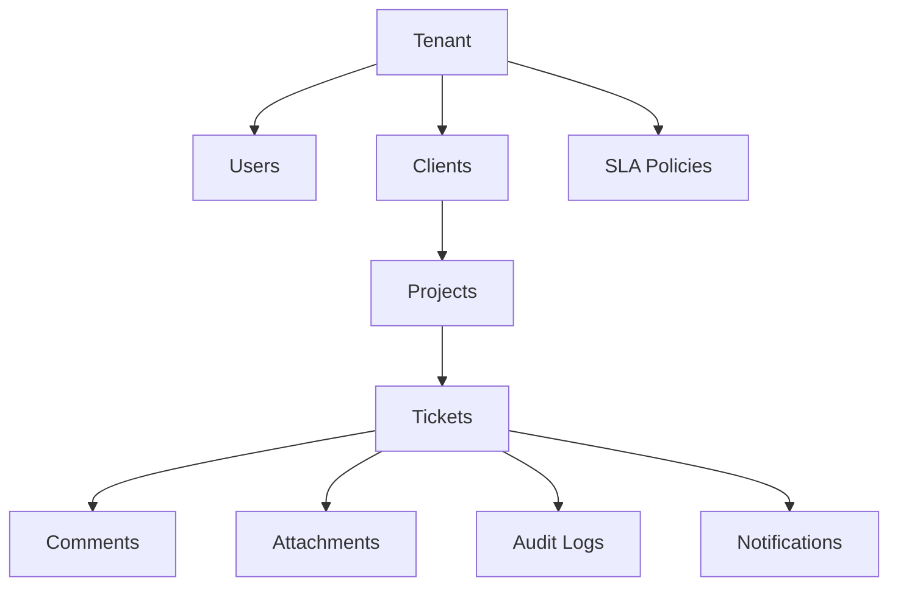

---

## 11.3 Data Ownership

Every business entity has a clearly defined owner.

| Entity       | Owned By |
| ------------ | -------- |
| User         | Tenant   |
| Client       | Tenant   |
| Project      | Client   |
| Ticket       | Project  |
| Comment      | Ticket   |
| Attachment   | Ticket   |
| Notification | Tenant   |
| SLA Policy   | Tenant   |
| Audit Log    | Tenant   |

This ownership hierarchy establishes clear authorization boundaries and simplifies data lifecycle management.

---

## 11.4 Data Relationships

The application primarily uses one-to-many relationships.

Examples include:

- One Tenant → Many Users
- One Tenant → Many Clients
- One Client → Many Projects
- One Project → Many Tickets
- One Ticket → Many Comments
- One Ticket → Many Attachments

Relationships are designed to maintain referential integrity while minimizing unnecessary duplication.

---

## 11.5 Tenant Isolation

All business data is partitioned logically by tenant.

```text
Tenant A
 ├── Users
 ├── Clients
 ├── Projects
 └── Tickets

Tenant B
 ├── Users
 ├── Clients
 ├── Projects
 └── Tickets
```

Application services ensure that queries operate only within the authenticated tenant context.

---

## 11.6 Transaction Management

Business operations involving multiple related changes are executed as atomic transactions.

Typical transactional operations include:

- Ticket creation
- Ticket assignment
- Ticket status updates
- User provisioning
- Client creation
- Project creation

A transaction either completes successfully in its entirety or is rolled back to preserve data consistency.

---

## 11.7 Data Integrity

The architecture maintains data integrity through:

- Primary keys for entity identity
- Foreign keys for relationship consistency
- Unique constraints for business identifiers
- Validation before persistence
- Transactional operations
- Referential integrity

These mechanisms ensure that business data remains accurate and internally consistent.

---

## 11.8 Data Lifecycle

Business entities progress through defined lifecycle stages.

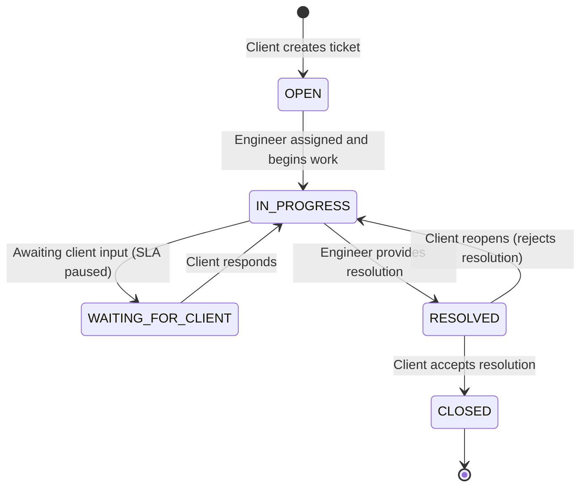

> **Canonical TicketStatus enum:** `OPEN | IN_PROGRESS | WAITING_FOR_CLIENT | RESOLVED | CLOSED`
> Assignment is a field update on an `OPEN` ticket, not a separate state.
> Reopening transitions a ticket back to `IN_PROGRESS`.

Not every entity follows every stage; the lifecycle depends on business requirements.

---

## 11.9 Storage Strategy

Different categories of data are stored according to their characteristics.

| Data Type     | Storage                               |
| ------------- | ------------------------------------- |
| Business Data | Relational Database                   |
| Attachments   | Object Storage                        |
| Audit Records | Relational Database                   |
| Notifications | Relational Database                   |
| Session Data  | Session Store / Cache (if applicable) |

This separation improves scalability while keeping transactional data consistent.

---

## 11.10 Data Access Principles

The application follows the following principles when interacting with data:

### Single Source of Truth

Business entities are stored in a single authoritative location.

### Consistency

All business operations preserve relational integrity and transactional consistency.

### Tenant Awareness

Every business operation executes within a validated tenant context.

### Controlled Access

Data is accessed only through the application's business modules.

### Extensibility

The schema is designed to support future business capabilities without significant structural changes.

---

## 11.11 Data Summary

The data architecture provides a structured, tenant-aware model that supports transactional consistency, strong integrity, and scalable growth while maintaining clear ownership and relationship boundaries across all business entities.

# 12. Background Processing Architecture

## 12.1 Overview

Not all business operations are executed as part of the synchronous request-response lifecycle.

The application includes a background processing subsystem responsible for executing asynchronous and scheduled tasks that do not require immediate user interaction.

Moving long-running or time-based operations to the background improves application responsiveness, scalability, and reliability.

---

## 12.2 Background Processing Architecture

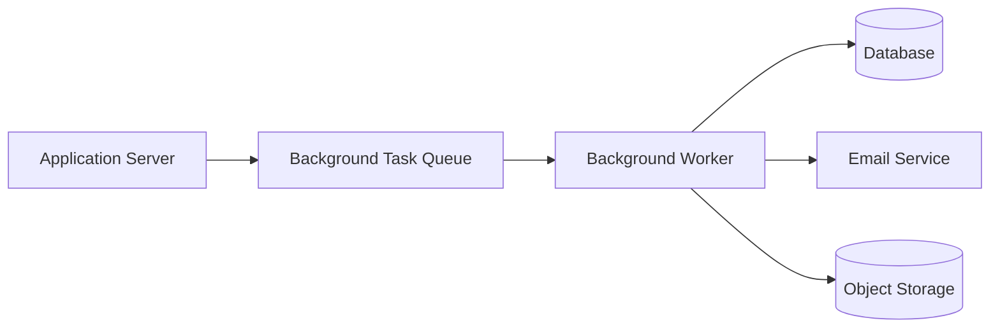

---

## 12.3 Responsibilities

Background processing is responsible for:

- SLA monitoring
- Notification delivery
- Email delivery
- Escalation processing
- Scheduled reminders
- Report generation
- Data cleanup
- Retry of failed operations
- Periodic maintenance tasks

Business operations requiring an immediate user response remain part of the synchronous request lifecycle.

---

## 12.4 Task Categories

### Event-Driven Tasks

These tasks are triggered by business events.

Examples include:

- Ticket created
- Ticket assigned
- Ticket closed
- User invited
- Client created

Event-driven tasks execute shortly after the originating business operation.

---

### Scheduled Tasks

Scheduled tasks execute at predefined intervals.

Examples include:

- SLA evaluation
- Reminder generation
- Report creation
- Cleanup operations
- Health checks

---

### Retry Tasks

Certain operations may fail because of temporary infrastructure issues.

Examples include:

- Email delivery
- Notification delivery
- External service communication

Retry processing improves reliability without requiring user intervention.

---

## 12.5 SLA Monitoring

SLA compliance is continuously evaluated in the background.

```mermaid
sequenceDiagram

participant Scheduler

participant SLA

participant Database

participant Notification

Scheduler->>SLA: Execute SLA Evaluation

SLA->>Database: Retrieve Active Tickets

Database-->>SLA: Ticket Data

SLA->>SLA: Evaluate Targets

alt SLA Breached

SLA->>Notification: Generate Alert

end
```

SLA monitoring operates independently of user activity to ensure accurate tracking of response and resolution commitments.

---

## 12.6 Notification Processing

Business modules publish notification events instead of sending notifications directly.

```mermaid
flowchart LR

    Ticket["Ticket Module"]
    NotificationEvent["Notification Event"]
    BackgroundWorker["Background Worker"]
    Email["Email Service"]
    InApp["In-App Notification"]

    Ticket --> NotificationEvent
    NotificationEvent --> BackgroundWorker
    BackgroundWorker --> Email
    BackgroundWorker --> InApp
```

This decouples business logic from notification delivery and improves response times.

---

## 12.7 Report Generation

Operational reports may involve significant data aggregation.

Large reports are generated asynchronously to avoid long-running user requests.

Generated reports can be made available for later retrieval by authorized users.

---

## 12.8 Maintenance Tasks

Background maintenance supports long-term platform stability.

Typical maintenance activities include:

- Cleanup of expired sessions
- Removal of temporary files
- Archiving historical data
- Log maintenance
- Database optimization tasks

Maintenance activities should not disrupt normal business operations.

---

## 12.9 Failure Handling

Background tasks may encounter temporary failures.

The processing architecture should support:

- Automatic retries
- Error logging
- Failure monitoring
- Dead-letter handling for unrecoverable tasks
- Administrative visibility into failed jobs

Failed background operations must not compromise transactional business data.

---

## 12.10 Background Processing Principles

### Asynchronous Execution

Time-consuming operations execute outside the user request lifecycle.

### Reliability

Tasks should tolerate temporary failures and recover automatically whenever possible.

### Idempotency

Tasks should produce the same outcome when executed multiple times, preventing duplicate emails, notifications, or state changes.

### Isolation

A failure in one background task must not affect unrelated processing.

### Observability

Background execution should produce sufficient logs and metrics for operational monitoring and troubleshooting.

---

## 12.11 Background Processing Summary

The background processing architecture enables the platform to perform time-based, event-driven, and long-running operations efficiently while keeping user interactions responsive.

By separating asynchronous workloads from synchronous business operations, the system achieves improved scalability, reliability, and operational resilience.

# 13. Scalability & Performance Architecture

## 13.1 Overview

The platform is designed to support increasing numbers of tenants, users, projects, and tickets while maintaining consistent performance and reliability.

Scalability is achieved through a combination of stateless application design, efficient data access, asynchronous processing, and independent scaling of infrastructure components.

The architecture supports both vertical and horizontal growth as business requirements evolve.

---

## 13.2 Scalability Architecture

```mermaid
flowchart TB

CLIENTS[Users]

LB[Load Balancer]

APP1[Application Instance]
APP2[Application Instance]
APP3[Application Instance]

DB[(PostgreSQL)]

CACHE[(Cache)]

STORAGE[(Object Storage)]

CLIENTS --> LB

LB --> APP1
LB --> APP2
LB --> APP3

APP1 --> CACHE
APP2 --> CACHE
APP3 --> CACHE

APP1 --> DB
APP2 --> DB
APP3 --> DB

APP1 --> STORAGE
APP2 --> STORAGE
APP3 --> STORAGE
```

The architecture allows additional application instances to be introduced without modifying business logic.

---

## 13.3 Stateless Application Design

Application instances do not maintain user-specific state between requests.

All persistent business information resides in shared platform services such as:

- Database
- Session store
- Object storage
- Background processing system

Stateless application instances enable horizontal scaling and simplify deployment.

---

## 13.4 Horizontal Scaling

The architecture supports horizontal scaling by increasing the number of application instances.

```text
10 Users
     ↓
1 Application Instance

100 Users
     ↓
2–3 Application Instances

1,000 Users
     ↓
5–8 Application Instances

10,000+ Users
     ↓
Load Balanced Application Cluster
```

Horizontal scaling increases request handling capacity while improving availability.

---

## 13.5 Database Scalability

The relational database remains the authoritative source of business data.

Scalability strategies include:

- Efficient indexing
- Optimized query execution
- Connection pooling
- Read optimization
- Transaction management
- Controlled schema evolution

As demand grows, read replicas and database partitioning may be introduced without changing application behavior.

---

## 13.6 Caching Strategy

Frequently accessed or computationally expensive data may be cached to reduce latency and database load.

Typical caching candidates include:

- User profile information
- Tenant configuration
- Role and permission data
- Dashboard summaries
- Frequently accessed reference data

```mermaid
flowchart LR

    Application["Application"]
    Cache["Cache"]
    Database[("Database")]
    Response["Response"]

    Application --> Cache
    Cache -->|Cache Miss| Database
    Database -->|Populate| Cache
    Cache --> Response
```

The cache serves as a performance optimization and is not treated as the source of truth.

---

## 13.7 Pagination

Large collections are retrieved using pagination rather than loading complete datasets.

Examples include:

- Ticket lists
- Projects
- Clients
- Users
- Audit logs
- Notifications

Pagination reduces memory consumption, network transfer, and response times.

---

## 13.8 Efficient Query Processing

Application queries should retrieve only the data required for the requested operation.

Guiding principles include:

- Avoid unnecessary joins
- Limit selected columns
- Apply filtering at the database level
- Prevent repeated retrieval of identical data
- Minimize redundant queries

These practices improve responsiveness while reducing database load.

---

## 13.9 File Storage Scalability

Attachments are stored separately from transactional business data.

Benefits include:

- Reduced database size
- Improved backup efficiency
- Independent storage scaling
- Support for large file collections
- Simplified file lifecycle management

The application stores only file metadata within the relational database.

---

## 13.10 Background Workload Distribution

Long-running operations are executed independently of user requests.

Examples include:

- SLA monitoring
- Email delivery
- Notification processing
- Report generation
- Scheduled maintenance

Separating these workloads prevents background processing from affecting interactive user performance.

---

## 13.11 Performance Optimization Principles

The architecture follows several performance principles:

### Minimize Network Requests

Reduce unnecessary communication between client and server.

---

### Minimize Database Operations

Retrieve only the required data while avoiding redundant queries.

---

### Reduce Blocking Operations

Move long-running work to asynchronous processing whenever practical.

---

### Efficient Resource Utilization

Optimize CPU, memory, storage, and network usage without sacrificing maintainability.

---

### Progressive Scalability

Infrastructure should scale incrementally based on demand rather than requiring major architectural redesign.

---

## 13.12 Capacity Planning

The architecture is designed to accommodate growth across multiple dimensions:

| Growth Dimension | Example                           |
| ---------------- | --------------------------------- |
| Tenants          | Increasing customer organizations |
| Users            | Growing user base                 |
| Projects         | More client projects              |
| Tickets          | Higher support volume             |
| Attachments      | Increased storage requirements    |
| Background Jobs  | Greater asynchronous workload     |

Capacity should be monitored continuously to identify scaling requirements before performance degradation occurs.

---

## 13.13 Scalability Summary

The platform combines stateless application services, efficient data access, caching, asynchronous processing, and independently scalable infrastructure to support long-term growth.

This architecture enables the platform to increase capacity while preserving maintainability, availability, and predictable performance.

# 14. Observability & Monitoring Architecture

## 14.1 Overview

Observability enables operators to understand the internal state of the platform through logs, metrics, traces, and health information.

The monitoring architecture is designed to support proactive issue detection, rapid troubleshooting, performance analysis, and operational visibility across all application components.

Observability is implemented as a platform-wide capability rather than as an individual module.

---

## 14.2 Observability Architecture

```mermaid
flowchart LR

APP[Application]

WORKER[Background Workers]

DB[(Database)]

APP --> LOGS[Structured Logs]
APP --> METRICS[Metrics]
APP --> TRACES[Request Traces]

WORKER --> LOGS
WORKER --> METRICS

DB --> METRICS

LOGS --> DASHBOARD[Monitoring Platform]
METRICS --> DASHBOARD
TRACES --> DASHBOARD

DASHBOARD --> ALERTS[Alerting]
```

---

## 14.3 Logging

Every significant application event should produce structured logs.

Logs provide visibility into:

- User requests
- Business operations
- Authentication events
- Authorization failures
- Background jobs
- External service interactions
- System errors

Logs should be structured to support efficient searching and filtering.

---

## 14.4 Log Categories

| Category          | Examples                             |
| ----------------- | ------------------------------------ |
| Application       | Startup, shutdown, configuration     |
| Authentication    | Login, logout, failed authentication |
| Authorization     | Permission denied                    |
| Business          | Ticket creation, assignment, closure |
| Background Jobs   | SLA evaluation, email delivery       |
| Database          | Query failures, transaction failures |
| External Services | Email service, object storage        |
| System            | Unexpected exceptions                |

---

## 14.5 Metrics

Metrics provide quantitative insight into platform behavior over time.

Typical application metrics include:

- Active users
- Active tenants
- API request count
- Request latency
- Error rate
- Background job throughput
- Queue depth
- Database response time
- Attachment storage usage

Metrics should support both operational monitoring and long-term capacity planning.

---

## 14.6 Request Tracing

Each request should be traceable throughout its lifecycle.

```mermaid
sequenceDiagram

participant User
participant API
participant Ticket
participant Notification
participant Database

User->>API: Request

API->>Ticket: Business Operation

Ticket->>Database: Save Data

Ticket->>Notification: Publish Event

Notification-->>API: Complete

API-->>User: Response
```

Tracing enables operators to identify where latency or failures occur during request processing.

---

## 14.7 Health Checks

Health checks allow automated systems to determine whether application components are operating correctly.

Typical health checks include:

- Application availability
- Database connectivity
- Background worker availability
- Object storage connectivity
- Email service availability

Health endpoints should return only operational status and never expose sensitive information.

---

## 14.8 Alerting

Alerts notify operators when platform behavior deviates from expected thresholds.

Examples include:

- High error rates
- Application downtime
- Database connectivity failures
- SLA processing failures
- Queue backlog growth
- Excessive request latency
- Background worker failures
- Low storage availability

Alerts should be actionable and minimize false positives.

---

## 14.9 Error Reporting

Unexpected application errors should be captured with sufficient context to support diagnosis.

Error reports should include:

- Timestamp
- Request identifier
- Tenant identifier
- User identifier (where appropriate)
- Module
- Operation
- Error category

Sensitive information such as passwords, authentication tokens, and confidential business data must never be included in error reports.

---

## 14.10 Operational Dashboards

Operational dashboards provide real-time visibility into platform health.

Typical dashboards include:

| Dashboard          | Purpose                                 |
| ------------------ | --------------------------------------- |
| Application Health | Overall system status                   |
| API Performance    | Request volume and latency              |
| Background Jobs    | Worker activity and failures            |
| SLA Monitoring     | SLA processing statistics               |
| Infrastructure     | Resource utilization                    |
| Security           | Authentication and authorization events |

---

## 14.11 Monitoring Principles

### Centralized Visibility

Operational information should be available through a unified monitoring platform.

---

### Structured Logging

Logs should be machine-readable and consistently formatted.

---

### Correlation

Related events should share a common request identifier to simplify troubleshooting.

---

### Actionable Alerts

Alerts should indicate conditions requiring operator intervention.

---

### Operational Transparency

System health should be measurable using observable platform metrics rather than assumptions.

---

## 14.12 Observability Summary

The observability architecture combines structured logging, metrics, request tracing, health checks, dashboards, and alerting to provide comprehensive operational visibility.

This enables rapid incident response, simplifies troubleshooting, supports performance optimization, and improves long-term platform reliability.

# 15. Deployment Architecture

## 15.1 Overview

The deployment architecture defines how the application's components are deployed, interconnected, and operated within production environments.

The platform is designed to support secure, highly available, and scalable deployments while maintaining clear separation between application services, persistent storage, and supporting infrastructure.

The deployment architecture remains independent of any specific cloud provider and can be adapted to on-premises or cloud environments.

---

## 15.2 Production Deployment Overview

```mermaid
flowchart TB

subgraph Internet

USER[Users]

end

subgraph Edge

LB[Load Balancer / Reverse Proxy]

end

subgraph Application Tier

APP1[Application Instance]

APP2[Application Instance]

APP3[Application Instance]

WORKER[Background Workers]

end

subgraph Data Tier

DB[(PostgreSQL)]

CACHE[(Cache)]

OBJ[(Object Storage)]

end

subgraph External Services

EMAIL[Email Service]

end

USER --> LB

LB --> APP1
LB --> APP2
LB --> APP3

APP1 --> DB
APP2 --> DB
APP3 --> DB

APP1 --> CACHE
APP2 --> CACHE
APP3 --> CACHE

APP1 --> OBJ
APP2 --> OBJ
APP3 --> OBJ

APP1 --> EMAIL
APP2 --> EMAIL
APP3 --> EMAIL

WORKER --> DB
WORKER --> CACHE
WORKER --> OBJ
WORKER --> EMAIL
```

---

## 15.3 Deployment Components

| Component             | Responsibility                                             |
| --------------------- | ---------------------------------------------------------- |
| Load Balancer         | Distributes incoming requests across application instances |
| Application Instances | Execute business logic and serve API requests              |
| Background Workers    | Process asynchronous tasks and scheduled jobs              |
| PostgreSQL            | Persistent relational data storage                         |
| Cache                 | Improve response times and reduce database load            |
| Object Storage        | Store ticket attachments and uploaded files                |
| Email Service         | Deliver transactional email notifications                  |

---

## 15.4 Environment Strategy

The platform supports multiple isolated environments throughout the software lifecycle.

| Environment | Purpose                                     |
| ----------- | ------------------------------------------- |
| Development | Feature development and local testing       |
| Testing     | Automated integration and quality assurance |
| Staging     | Pre-production validation                   |
| Production  | Live customer environment                   |

Each environment maintains independent configuration, infrastructure, and application data.

---

## 15.5 High Availability

The deployment architecture improves availability through:

- Multiple application instances
- Load-balanced request distribution
- Independent background workers
- Health checks
- Automatic recovery of failed instances
- Redundant infrastructure where applicable

No single application instance is required for continued operation.

---

## 15.6 Configuration Management

Application behavior is controlled through external configuration rather than source code changes.

Configuration includes:

- Database connection settings
- Authentication configuration
- Email provider settings
- File storage configuration
- Rate limits
- Feature flags
- Logging levels

Environment-specific configuration is isolated between deployment environments.

---

## 15.7 Secrets Management

Sensitive credentials are managed securely outside the application codebase.

Examples include:

- Database credentials
- API keys
- JWT signing secrets
- SMTP credentials
- Object storage credentials

Secrets should never be committed to source control or exposed through application logs.

---

## 15.8 Backup and Recovery

The platform should support regular backup and recovery procedures.

Protected assets include:

- Relational database
- Uploaded attachments
- Application configuration
- Audit records

Recovery procedures should be periodically validated to ensure operational readiness.

---

## 15.9 Disaster Recovery

The deployment architecture supports disaster recovery through:

- Regular backups
- Infrastructure recreation
- Configuration restoration
- Data restoration
- Controlled service recovery

Recovery objectives should align with business continuity requirements.

---

## 15.10 Deployment Principles

### Environment Isolation

Each deployment environment operates independently.

---

### Immutable Deployments

Application artifacts should be built once and promoted across environments without modification.

---

### Zero or Minimal Downtime

Deployments should minimize disruption to active users through rolling or blue-green deployment strategies where supported.

---

### Horizontal Scalability

Application capacity should increase by adding instances rather than modifying application behavior.

---

### Operational Simplicity

The deployment process should remain repeatable, automated, and easy to maintain.

---

## 15.11 Deployment Summary

The deployment architecture provides a scalable, resilient, and environment-independent foundation for operating the platform in production.

By separating application services, data services, background processing, and supporting infrastructure, the architecture enables reliable deployments, operational flexibility, and future growth.

# 16. Architectural Decision Records

## Overview

Architectural Decision Records (ADRs) capture significant design decisions, the alternatives considered, and the rationale for the selected approach.

These records provide long-term context for future maintenance and evolution of the platform.

---

## ADR-001: Modular Monolith

**Decision**

Adopt a modular monolith architecture.

**Rationale**

- Faster development
- Simpler deployment
- Easier debugging
- Lower operational complexity
- Clear module boundaries

**Alternatives Considered**

- Microservices
- Service-Oriented Architecture

---

## ADR-002: Shared Database Multi-Tenancy

**Decision**

Use a shared database with logical tenant isolation.

**Rationale**

- Reduced infrastructure cost
- Simpler maintenance
- Easier onboarding of new tenants
- Centralized administration

**Alternatives Considered**

- Database per tenant
- Schema per tenant

---

## ADR-003: Stateless Application Servers

**Decision**

Application instances remain stateless.

**Rationale**

- Horizontal scalability
- Simplified deployments
- Improved fault tolerance

---

## ADR-004: Asynchronous Background Processing

**Decision**

Execute long-running operations asynchronously.

**Rationale**

- Faster user responses
- Better scalability
- Improved reliability

---

## ADR-005: Object Storage for Attachments

**Decision**

Store uploaded files outside the relational database.

**Rationale**

- Better database performance
- Independent storage scaling
- Simplified backup strategy

---

## ADR-006: Layered Backend Architecture

**Decision**

Separate presentation, application, domain, and infrastructure responsibilities.

**Rationale**

- Improved maintainability
- Better testability
- Reduced coupling
- Clear ownership of business logic

---

## ADR-007: RBAC Authorization

**Decision**

Use role-based access control.

**Rationale**

- Centralized permission management
- Consistent authorization
- Simplified administration

# 17. Future Evolution

## 17.1 Overview

The architecture has been designed to accommodate future business and technical requirements without requiring fundamental redesign.

The following enhancements may be introduced incrementally as the platform evolves.

---

## 17.2 Potential Enhancements

### Event-Driven Architecture

Introduce an event bus to decouple business modules and improve scalability.

---

### Microservices

Extract selected business modules into independent services when justified by operational or scaling requirements.

Potential candidates include:

- Notification Service
- Reporting Service
- Search Service
- File Management

---

### Full-Text Search

Introduce dedicated search infrastructure for advanced ticket and knowledge-base search capabilities.

---

### Read Replicas

Use database read replicas to improve read scalability and reporting performance.

---

### Database Partitioning

Partition high-volume entities such as tickets and audit logs to support larger datasets.

---

### Multi-Region Deployment

Deploy application instances across multiple geographic regions to improve availability and reduce latency.

---

### Real-Time Collaboration

Enhance ticket collaboration with real-time presence, typing indicators, and live updates.

---

### AI-Assisted Features

Potential AI capabilities include:

- Automatic ticket categorization
- Priority prediction
- Duplicate ticket detection
- Response suggestions
- SLA breach prediction
- Ticket summarization
- Knowledge base recommendations

---

### Advanced Analytics

Expand reporting capabilities with predictive analytics, operational trends, and customizable dashboards.

---

## 17.3 Architectural Principles for Evolution

Future enhancements should preserve the following principles:

- Modular design
- Loose coupling
- Tenant isolation
- Security by default
- Backward compatibility where practical
- Incremental adoption

---

## 17.4 Conclusion

The architecture provides a solid foundation for the current platform while remaining flexible enough to accommodate future business growth, increased scale, and emerging technologies.

By emphasizing modularity, security, scalability, and operational excellence, the platform can evolve without compromising maintainability or reliability.

# 18. Quality Attributes

## 18.1 Overview

The architecture is designed to satisfy key quality attributes that influence the long-term success of the platform. These attributes guide architectural decisions and establish measurable expectations for system behavior under operational conditions.

---

## 18.2 Availability

The platform should remain operational despite failures of individual application instances.

Supporting architectural decisions:

- Multiple application instances
- Load balancing
- Health monitoring
- Background worker isolation
- Fault-tolerant infrastructure

---

## 18.3 Scalability

The platform should accommodate increasing workloads without significant architectural redesign.

Supporting architectural decisions:

- Stateless application servers
- Horizontal scaling
- Shared object storage
- Background processing
- Modular architecture

---

## 18.4 Performance

The system should provide responsive interactions for common business operations.

Supporting architectural decisions:

- Efficient database access
- Pagination
- Caching
- Asynchronous processing
- Optimized request lifecycle

---

## 18.5 Security

The platform protects user identities, tenant data, and business information.

Supporting architectural decisions:

- Authentication
- RBAC authorization
- Tenant isolation
- Audit logging
- Secure communication
- Input validation

---

## 18.6 Reliability

Business operations should complete correctly and preserve data integrity.

Supporting architectural decisions:

- Transaction management
- Referential integrity
- Retry mechanisms
- Structured error handling
- Background task recovery

---

## 18.7 Maintainability

The architecture should support efficient enhancement and maintenance.

Supporting architectural decisions:

- Modular design
- Layered architecture
- Separation of concerns
- Consistent interfaces
- ADR documentation

---

## 18.8 Observability

Platform behavior should be measurable and diagnosable.

Supporting architectural decisions:

- Structured logging
- Metrics
- Request tracing
- Health checks
- Operational dashboards

---

## 18.9 Summary

These quality attributes influence every architectural decision and provide the foundation for a secure, scalable, reliable, and maintainable enterprise platform.

# 19. Architectural Risks & Trade-offs

## 19.1 Overview

Architectural decisions involve trade-offs between simplicity, scalability, cost, performance, and operational complexity. This section documents the primary considerations associated with the selected architecture.

---

## 19.2 Shared Database Multi-Tenancy

### Benefits

- Lower infrastructure cost
- Simpler operations
- Faster onboarding
- Centralized management

### Risks

- Greater emphasis on tenant isolation
- Shared database resource contention
- More careful schema evolution

### Mitigation

- Strong tenant-aware authorization
- Optimized indexing
- Continuous performance monitoring

---

## 19.3 Modular Monolith

### Benefits

- Faster development
- Easier debugging
- Simpler deployments
- Lower operational overhead

### Risks

- Larger deployment units
- Increased codebase size over time

### Mitigation

- Strong module boundaries
- Clear ownership
- ADR-guided evolution
- Potential future extraction of services

---

## 19.4 Background Processing

### Benefits

- Faster user responses
- Improved scalability

### Risks

- Increased operational complexity
- Eventual consistency

### Mitigation

- Monitoring
- Retries
- Idempotent processing

---

## 19.5 Object Storage

### Benefits

- Better database performance
- Independent storage scaling

### Risks

- Additional infrastructure dependency

### Mitigation

- Retry logic
- Availability monitoring

# 20. Architecture Governance

## 20.1 Overview

Architecture governance establishes principles that guide future development while preserving consistency and maintainability.

---

## 20.2 Guiding Principles

New features should:

- Respect module boundaries
- Preserve tenant isolation
- Reuse existing business capabilities
- Maintain security standards
- Avoid unnecessary coupling

---

## 20.3 Architectural Reviews

Major architectural changes should evaluate:

- Security impact
- Scalability impact
- Operational impact
- Performance impact
- Maintainability
- Backward compatibility

---

## 20.4 Documentation Maintenance

The Software Architecture Document should be updated whenever:

- A new business module is introduced
- Deployment topology changes
- Security architecture changes
- New external integrations are added
- Major architectural decisions are made

Architectural Decision Records should accompany significant changes.

# 21. Glossary

| Term                   | Definition                                                                                     |
| ---------------------- | ---------------------------------------------------------------------------------------------- |
| Tenant                 | An independent customer organization using the platform.                                       |
| Platform Administrator | User responsible for managing the overall platform and all tenant organizations.               |
| Tenant Administrator   | User responsible for managing users, clients, projects, tickets, and SLAs within their tenant. |
| Client                 | An organization receiving support services from a tenant.                                      |
| Project                | A logical grouping of support tickets for a client.                                            |
| Ticket                 | A support request created by a client and tracked through the system.                          |
| Engineer               | A user responsible for resolving assigned support tickets.                                     |
| SLA                    | Service Level Agreement defining response and resolution time targets.                         |
| RBAC                   | Role-Based Access Control — the authorization model used to enforce permissions.               |
| Background Worker      | Component responsible for executing asynchronous and scheduled tasks.                          |
| Object Storage         | Storage system for ticket attachments and uploaded files.                                      |
| ADR                    | Architectural Decision Record — documents a significant design decision and its rationale.     |
| Modular Monolith       | A single deployable application organized into independent, loosely coupled modules.           |
| Tenant Context         | The tenant identity attached to every authenticated request to enforce data isolation.         |
| Dead-letter Queue      | A queue that holds tasks that could not be processed after all retry attempts.                 |
