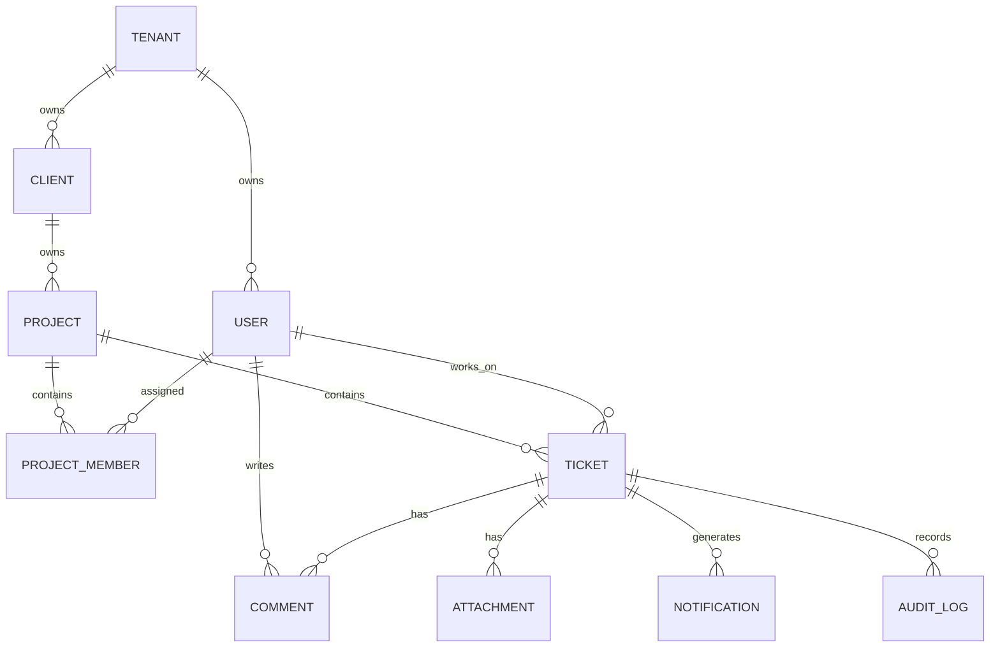
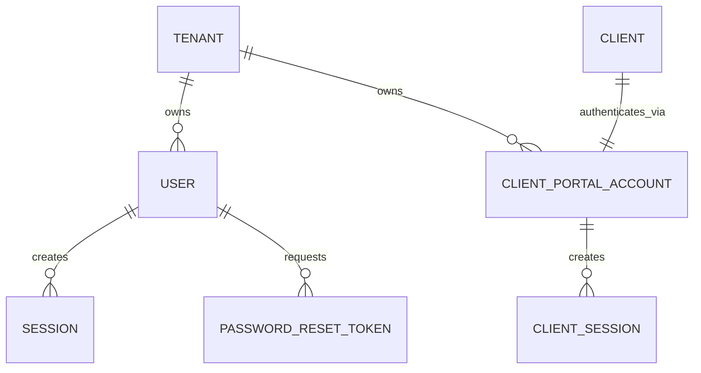
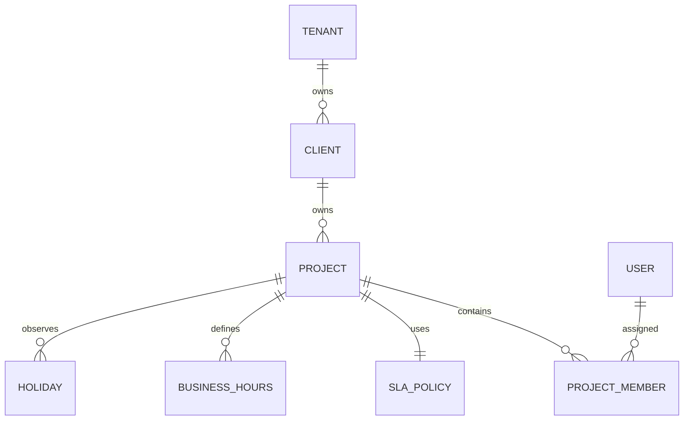
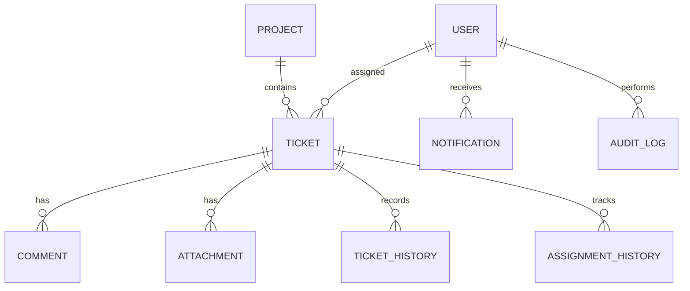

# Multi-Tenant Ticketing System

# Database Schema Specification

**Version:** 1.0  
**Status:** Draft  
**Owner:** Product & Engineering Team  
**Last Updated:** July 2026

---

# 1. Introduction

## 1.1 Purpose

This document defines the logical database design for the Multi-Tenant Ticketing System.

It serves as the single source of truth for the application's data model and is intended for backend engineers, frontend engineers, database administrators, architects, QA engineers, and DevOps teams.

The schema is designed to support:

- Multi-tenant SaaS architecture
- Secure tenant isolation
- Role-based access control
- Ticket lifecycle management
- SLA monitoring
- Notifications
- Audit logging
- Future scalability

This document complements:

- Product Requirements Document (PRD)
- Software Architecture Document
- Application Flow Document
- Phase Scope Document

---

# 2. Database Overview

| Property | Value |
|----------|-------|
| Database | PostgreSQL |
| ORM | Prisma |
| ID Strategy | UUID v4 |
| Multi-Tenant | Shared Database, Shared Schema |
| Soft Delete | Supported |
| Audit Logging | Supported |
| Transactions | ACID |
| Timezone | UTC |
| Character Encoding | UTF-8 |

---

# 3. Database Design Principles

The schema follows the following principles throughout the system.

## 3.1 Multi-Tenant First

Every business record belongs to exactly one tenant.

No tenant may access another tenant's data.

---

## 3.2 Normalized Design

The schema follows Third Normal Form (3NF) where appropriate.

Controlled denormalization may be introduced only for performance optimization.

---

## 3.3 Referential Integrity

Relationships are enforced through foreign key constraints.

Orphaned records are not permitted unless explicitly documented.

---

## 3.4 Auditability

Business entities retain creation and modification metadata.

Critical operations are additionally recorded in the Audit Log.

---

## 3.5 Scalability

Tables are designed to support:

- Millions of tickets
- Thousands of tenants
- High read/write concurrency
- Efficient indexing

---

# 4. Multi-Tenant Strategy

The application follows a **Shared Database / Shared Schema** architecture.

Every tenant owns an isolated logical partition of data.

All business entities include a `tenant_id` column.

Application middleware is responsible for resolving the active tenant and enforcing tenant-scoped queries.

```
Tenant
    │
    ├── Users
    ├── Clients
    ├── Projects
    ├── Tickets
    ├── Notifications
    └── Audit Logs
```

Cross-tenant queries are prohibited.

---

# 5. Naming Conventions

## Tables

- Singular nouns
- PascalCase

Examples:

- Tenant
- User
- Client
- Project
- Ticket

---

## Columns

- snake_case

Examples:

- created_at
- updated_at
- tenant_id
- assigned_to

---

## Primary Keys

Every table uses:

```
id UUID PRIMARY KEY
```

---

## Foreign Keys

Foreign keys use:

```
<entity>_id
```

Examples:

- tenant_id
- project_id
- client_id
- ticket_id

---

## Timestamps

All timestamps are stored in UTC.

---

# 6. Common Columns

Unless otherwise specified, every business table contains the following columns.

| Column | Type | Description |
|---------|------|-------------|
| id | UUID | Primary key |
| tenant_id | UUID | Tenant owner |
| created_at | TIMESTAMP | Record creation |
| updated_at | TIMESTAMP | Last modification |
| created_by | UUID | User who created the record |
| updated_by | UUID | Last user to modify |
| archived_at | TIMESTAMP NULL | Soft archive timestamp |

---

# 7. Audit Strategy

The application maintains two levels of auditing.

### Entity Audit

Every entity records:

- created_at
- updated_at
- created_by
- updated_by

---

### System Audit

Sensitive operations are additionally written to the AuditLog table.

Examples include:

- Login
- Role assignment
- Ticket assignment
- Status changes
- SLA breaches
- Configuration updates

---

# 8. Soft Archive Strategy

Business records are archived rather than permanently deleted.

Archived records:

- remain in the database
- are excluded from standard queries
- may be restored if required

Hard deletion is reserved for maintenance operations only.

---

# 9. Enum Definitions

## UserRole

- PLATFORM_ADMIN
- TENANT_ADMIN
- ENGINEER

---

## TicketStatus

- OPEN
- IN_PROGRESS
- WAITING_FOR_CLIENT
- RESOLVED
- CLOSED

---

## TicketPriority

- LOW
- MEDIUM
- HIGH
- CRITICAL

---

## NotificationType

- EMAIL
- IN_APP

---

## NotificationStatus

- PENDING
- SENT
- FAILED

---

# 10. Entity Relationship Diagram



---

# 11. High-Level Entity Summary

| Entity | Purpose |
|---------|---------|
| Tenant | Service provider organization |
| User | Internal platform user (Tenant Admin, Engineer) |
| ClientPortalAccount | Authentication credential for a Client organization |
| Client | Customer organization |
| Project | Client project |
| ProjectMember | Engineer assignment |
| Ticket | Support request |
| Comment | Ticket discussion (public or internal) |
| Attachment | Files linked to tickets |
| Notification | System notifications |
| AuditLog | Security and activity audit |

---

# 12. Next Section

The next section of this document defines each database table, including:

- Columns
- Data Types
- Constraints
- Foreign Keys
- Indexes
- Business Rules
---

# 13. Identity & Access

This section defines the database entities responsible for authentication, authorization, user management, and session management.

---

# 13.1 Tenant

## Purpose

Represents a tenant (service company) using the platform.

### Columns

| Column | Type | Constraints | Description |
|---------|------|------------|-------------|
| id | UUID | PK | Tenant identifier |
| name | VARCHAR(150) | NOT NULL | Company name |
| slug | VARCHAR(100) | UNIQUE | URL-friendly identifier |
| email | VARCHAR(255) | NOT NULL | Primary contact email |
| phone | VARCHAR(30) | NULL | Contact number |
| status | VARCHAR(20) | DEFAULT 'ACTIVE' | Tenant status |
| created_at | TIMESTAMP | NOT NULL | Creation timestamp |
| updated_at | TIMESTAMP | NOT NULL | Last update |
| archived_at | TIMESTAMP | NULL | Soft archive |

### Relationships

- One Tenant → Many Users (Tenant Admins and Engineers)
- One Tenant → Many Clients
- One Tenant → Many Projects (transitively via Client; denormalized tenant_id for query efficiency)
- One Tenant → Many Tickets (transitively via Project; denormalized tenant_id for query efficiency)

### Indexes

```sql
PRIMARY KEY(id)

UNIQUE(slug)

INDEX(status)
```

---

# 13.2 User

## Purpose

Represents an internal user belonging to a tenant.

Users can be:

- Tenant Admin
- Engineer

Platform administrators are stored separately from tenant users.

### Columns

| Column | Type | Constraints |
|---------|------|------------|
| id | UUID | PK |
| tenant_id | UUID | FK → Tenant |
| first_name | VARCHAR(100) | NOT NULL |
| last_name | VARCHAR(100) | NOT NULL |
| email | VARCHAR(255) | NOT NULL |
| password_hash | TEXT | NOT NULL |
| role | UserRole | NOT NULL |
| is_active | BOOLEAN | DEFAULT TRUE |
| last_login_at | TIMESTAMP | NULL |
| created_at | TIMESTAMP | NOT NULL |
| updated_at | TIMESTAMP | NOT NULL |
| archived_at | TIMESTAMP | NULL |

### Constraints

- Email unique within tenant
- Password stored only as hash
- Inactive users cannot authenticate

### Unique Constraints

```sql
UNIQUE(tenant_id,email)
```

### Indexes

```sql
INDEX(tenant_id)

INDEX(role)

INDEX(is_active)
```

---

# 13.3 Session

## Purpose

Stores authenticated user sessions.

Supports refresh-token rotation and secure logout.

### Columns

| Column | Type |
|---------|------|
| id | UUID |
| user_id | UUID |
| refresh_token_hash | TEXT |
| expires_at | TIMESTAMP |
| ip_address | VARCHAR(100) |
| user_agent | TEXT |
| revoked_at | TIMESTAMP |
| created_at | TIMESTAMP |

### Relationships

Many Sessions → One User

### Business Rules

- Only hashed refresh tokens stored.
- Expired sessions rejected.
- Revoked sessions cannot be reused.

### Indexes

```sql
INDEX(user_id)

INDEX(expires_at)
```

---

# 13.4 PasswordResetToken

## Purpose

Stores password reset requests.

### Columns

| Column | Type |
|---------|------|
| id | UUID |
| user_id | UUID |
| token_hash | TEXT |
| expires_at | TIMESTAMP |
| used_at | TIMESTAMP |
| created_at | TIMESTAMP |

### Business Rules

- Token stored as hash.
- Single use only.
- Automatically expires.

---

# 13.5 ClientPortalAccount

## Purpose

Stores the single authentication credential for a Client organization (MVP: one login per client).

This is intentionally separate from the User table to preserve a clean boundary between internal staff and client-facing access.

### Columns

| Column | Type | Constraints | Description |
|---------|------|------------|-------------|
| id | UUID | PK | Account identifier |
| tenant_id | UUID | FK → Tenant | Owning tenant |
| client_id | UUID | FK → Client, UNIQUE | The client this account represents |
| email | VARCHAR(255) | NOT NULL | Login email |
| password_hash | TEXT | NOT NULL | Bcrypt/Argon2 hash |
| is_active | BOOLEAN | DEFAULT TRUE | Account enabled flag |
| last_login_at | TIMESTAMP | NULL | Last successful login |
| created_at | TIMESTAMP | NOT NULL | Creation timestamp |
| updated_at | TIMESTAMP | NOT NULL | Last update |
| archived_at | TIMESTAMP | NULL | Soft archive |

### Constraints

- One ClientPortalAccount per Client (enforced by UNIQUE on client_id).
- Email unique across all ClientPortalAccounts within a tenant.
- Archived accounts cannot authenticate.
- Password stored only as hash.

### Unique Constraints

```sql
UNIQUE(client_id)
UNIQUE(tenant_id, email)
```

### Indexes

```sql
INDEX(tenant_id)
INDEX(client_id)
INDEX(is_active)
```

---

# 13.6 ClientSession

## Purpose

Stores authenticated client portal sessions.

Mirrors the Session table but references ClientPortalAccount instead of User.

### Columns

| Column | Type | Constraints |
|---------|------|------------|
| id | UUID | PK |
| account_id | UUID | FK → ClientPortalAccount |
| refresh_token_hash | TEXT | NOT NULL |
| expires_at | TIMESTAMP | NOT NULL |
| ip_address | VARCHAR(100) | NULL |
| user_agent | TEXT | NULL |
| revoked_at | TIMESTAMP | NULL |
| created_at | TIMESTAMP | NOT NULL |

### Business Rules

- Only hashed refresh tokens stored.
- Expired sessions rejected.
- Revoked sessions cannot be reused.

### Indexes

```sql
INDEX(account_id)
INDEX(expires_at)
```

---

# 13.7 Relationships



---

# 13.8 Identity Constraints

- Every User belongs to exactly one Tenant.
- User email must be unique within a Tenant.
- Every ClientPortalAccount belongs to exactly one Client.
- Exactly one ClientPortalAccount exists per Client (MVP constraint).
- ClientPortalAccount email must be unique within a Tenant.
- Authentication always resolves Tenant first.
- Passwords are never stored in plaintext.
- Refresh tokens are always hashed.
- Archived Users and ClientPortalAccounts cannot log in.
- Deactivated users retain historical ownership of tickets.

---

# 13.9 Identity Index Strategy

```sql
Tenant

PRIMARY KEY(id)

UNIQUE(slug)

-----------------------

User

PRIMARY KEY(id)

UNIQUE(tenant_id,email)

INDEX(tenant_id)

INDEX(role)

INDEX(is_active)

-----------------------

ClientPortalAccount

PRIMARY KEY(id)

UNIQUE(client_id)

UNIQUE(tenant_id, email)

INDEX(tenant_id)

INDEX(client_id)

INDEX(is_active)

-----------------------

Session

PRIMARY KEY(id)

INDEX(user_id)

INDEX(expires_at)

-----------------------

ClientSession

PRIMARY KEY(id)

INDEX(account_id)

INDEX(expires_at)

-----------------------

PasswordResetToken

PRIMARY KEY(id)

INDEX(user_id)

INDEX(expires_at)
```

---

# 13.10 Definition of Done

The Identity schema is complete when:

- Tenant model finalized.
- User model finalized.
- ClientPortalAccount model finalized.
- ClientSession model finalized.
- Session model finalized.
- Password reset model finalized.
- Foreign keys validated.
- Indexes reviewed.
- Constraints documented.
---

# 14. Organization Management

This section defines the entities responsible for managing clients, projects, project memberships, and project-level configurations.

---

# 14.1 Client

## Purpose

Represents a customer organization receiving support from a tenant.

A tenant may manage multiple clients.

### Columns

| Column | Type | Constraints | Description |
|---------|------|------------|-------------|
| id | UUID | PK | Client identifier |
| tenant_id | UUID | FK → Tenant | Tenant owner |
| name | VARCHAR(150) | NOT NULL | Client name |
| email | VARCHAR(255) | NULL | Primary contact email |
| phone | VARCHAR(30) | NULL | Contact number |
| company | VARCHAR(150) | NULL | Company name |
| status | VARCHAR(20) | DEFAULT 'ACTIVE' | Client status |
| created_at | TIMESTAMP | NOT NULL | Creation timestamp |
| updated_at | TIMESTAMP | NOT NULL | Last modification |
| archived_at | TIMESTAMP | NULL | Soft archive |

### Constraints

- Client name required
- Client name unique within tenant
- Archived clients cannot own new projects

### Relationships

- One Tenant → Many Clients
- One Client → Many Projects

### Unique Constraints

```sql
UNIQUE(tenant_id, name)
```

### Indexes

```sql
INDEX(tenant_id)

INDEX(status)

INDEX(name)
```

---

# 14.2 Project

## Purpose

Represents a support project owned by a client.

Tickets are always created under a project.

### Columns

| Column | Type | Constraints |
|---------|------|------------|
| id | UUID | PK |
| tenant_id | UUID | FK → Tenant |
| client_id | UUID | FK → Client |
| name | VARCHAR(150) | NOT NULL |
| description | TEXT | NULL |
| status | VARCHAR(20) | DEFAULT 'ACTIVE' |
| created_at | TIMESTAMP | NOT NULL |
| updated_at | TIMESTAMP | NOT NULL |
| archived_at | TIMESTAMP | NULL |

### Constraints

- Project belongs to one client
- Project belongs to one tenant
- Archived projects cannot receive new tickets

### Relationships

- One Client → Many Projects
- One Project → Many Tickets
- One Project → Many Project Members

### Unique Constraints

```sql
UNIQUE(tenant_id, client_id, name)
```

### Indexes

```sql
INDEX(tenant_id)

INDEX(client_id)

INDEX(status)
```

---

# 14.3 ProjectMember

## Purpose

Maps engineers to projects.

A user may belong to multiple projects.

A project may contain multiple engineers.

### Columns

| Column | Type | Constraints |
|---------|------|------------|
| id | UUID | PK |
| tenant_id | UUID | FK → Tenant |
| project_id | UUID | FK → Project |
| user_id | UUID | FK → User |
| assigned_at | TIMESTAMP | NOT NULL |
| assigned_by | UUID | FK → User |

### Constraints

- Duplicate assignments not allowed
- Only active users may be assigned

### Relationships

- Many Project Members → One Project
- Many Project Members → One User

### Unique Constraints

```sql
UNIQUE(project_id, user_id)
```

### Indexes

```sql
INDEX(project_id)

INDEX(user_id)
```

---

# 14.4 SLAPolicy

## Purpose

Defines project-level SLA configuration.

Each project has one active SLA policy.

### Columns

| Column | Type | Constraints |
|---------|------|------------|
| id | UUID | PK |
| tenant_id | UUID | FK → Tenant |
| project_id | UUID | FK → Project |
| response_time_minutes | INTEGER | NOT NULL |
| resolution_time_minutes | INTEGER | NOT NULL |
| business_hours_enabled | BOOLEAN | DEFAULT TRUE |
| created_at | TIMESTAMP | NOT NULL |
| updated_at | TIMESTAMP | NOT NULL |

### Constraints

- Response time must be positive
- Resolution time must be greater than response time

### Relationships

- One Project → One SLA Policy

### Unique Constraints

```sql
UNIQUE(project_id)
```

### Indexes

```sql
INDEX(project_id)
```

---

# 14.5 BusinessHours

## Purpose

Stores working hours used for SLA calculations.

### Columns

| Column | Type |
|---------|------|
| id | UUID |
| tenant_id | UUID |
| project_id | UUID |
| day_of_week | SMALLINT |
| start_time | TIME |
| end_time | TIME |

### Constraints

- One entry per day
- Start time must be before end time

### Unique Constraints

```sql
UNIQUE(project_id, day_of_week)
```

---

# 14.6 Holiday

## Purpose

Defines non-working days excluded from SLA calculations.

### Columns

| Column | Type |
|---------|------|
| id | UUID |
| tenant_id | UUID |
| project_id | UUID |
| holiday_date | DATE |
| name | VARCHAR(150) |

### Constraints

- Duplicate holiday dates not allowed per project

### Unique Constraints

```sql
UNIQUE(project_id, holiday_date)
```

---

# 14.7 Relationships



---

# 14.8 Organization Constraints

- Every Client belongs to one Tenant.
- Every Project belongs to one Client.
- Every Project belongs to one Tenant.
- Engineers may belong to multiple Projects.
- Archived Projects cannot accept new Tickets.
- Only Tenant Admins can manage Clients, Projects, and SLA Policies.
- SLA Policy is mandatory before a project becomes active.

---

# 14.9 Organization Index Strategy

```sql
Client

PRIMARY KEY(id)

UNIQUE(tenant_id, name)

INDEX(tenant_id)

INDEX(status)

-----------------------

Project

PRIMARY KEY(id)

UNIQUE(tenant_id, client_id, name)

INDEX(tenant_id)

INDEX(client_id)

INDEX(status)

-----------------------

ProjectMember

PRIMARY KEY(id)

UNIQUE(project_id, user_id)

INDEX(project_id)

INDEX(user_id)

-----------------------

SLAPolicy

PRIMARY KEY(id)

UNIQUE(project_id)

INDEX(project_id)

-----------------------

BusinessHours

PRIMARY KEY(id)

UNIQUE(project_id, day_of_week)

-----------------------

Holiday

PRIMARY KEY(id)

UNIQUE(project_id, holiday_date)
```

---

# 14.10 Definition of Done

The Organization schema is complete when:

- Client model finalized.
- Project model finalized.
- Project membership finalized.
- SLA Policy finalized.
- Business Hours finalized.
- Holiday calendar finalized.
- Foreign keys validated.
- Constraints documented.
- Indexes reviewed.
---

# 15. Ticket Management

This section defines the core entities responsible for support ticket management, collaboration, attachments, notifications, and auditing.

---

# 15.1 Ticket

## Purpose

Represents a support request submitted by a client for a specific project.

The Ticket is the central business entity of the platform.

### Columns

| Column | Type | Constraints | Description |
|---------|------|------------|-------------|
| id | UUID | PK | Ticket identifier |
| tenant_id | UUID | FK → Tenant | Tenant owner |
| client_id | UUID | FK → Client | Client |
| project_id | UUID | FK → Project | Project |
| ticket_number | VARCHAR(30) | UNIQUE | Human-readable ticket ID |
| title | VARCHAR(200) | NOT NULL | Ticket title |
| description | TEXT | NOT NULL | Ticket description |
| status | TicketStatus | DEFAULT OPEN | Current status |
| priority | TicketPriority | DEFAULT MEDIUM | Priority |
| assigned_to | UUID | FK → User | Assigned engineer |
| resolved_at | TIMESTAMP | NULL | Resolution timestamp |
| closed_at | TIMESTAMP | NULL | Closure timestamp |
| created_at | TIMESTAMP | NOT NULL | Created |
| updated_at | TIMESTAMP | NOT NULL | Updated |
| archived_at | TIMESTAMP | NULL | Soft archive |

### Constraints

- Ticket belongs to one tenant.
- Ticket belongs to one client.
- Ticket belongs to one project.
- Title required.
- Description required.
- Assigned engineer must belong to the same tenant.
- Closed tickets cannot be modified.

### Relationships

- One Project → Many Tickets
- One Ticket → Many Comments
- One Ticket → Many Attachments
- One Ticket → Many History Records
- One Ticket → Many Notifications

### Unique Constraints

```sql
UNIQUE(ticket_number)
```

### Indexes

```sql
INDEX(tenant_id)

INDEX(project_id)

INDEX(client_id)

INDEX(status)

INDEX(priority)

INDEX(assigned_to)

INDEX(created_at DESC)
```

---

# 15.2 Comment

## Purpose

Stores discussions related to a ticket.

Supports public comments and internal notes.

### Columns

| Column | Type |
|---------|------|
| id | UUID |
| tenant_id | UUID |
| ticket_id | UUID |
| user_id | UUID |
| content | TEXT |
| is_internal | BOOLEAN |
| created_at | TIMESTAMP |
| updated_at | TIMESTAMP |

### Constraints

- Comment belongs to one ticket.
- Author cannot be null.
- Empty comments not allowed.

### Relationships

Many Comments → One Ticket

Many Comments → One User

### Indexes

```sql
INDEX(ticket_id)

INDEX(user_id)

INDEX(created_at)
```

---

# 15.3 Attachment

## Purpose

Stores metadata for files attached to tickets.

Actual files are stored in object storage (e.g., S3 or Cloudinary).

### Columns

| Column | Type |
|---------|------|
| id | UUID |
| tenant_id | UUID |
| ticket_id | UUID |
| uploaded_by | UUID |
| file_name | VARCHAR(255) |
| storage_key | TEXT |
| mime_type | VARCHAR(100) |
| file_size | BIGINT |
| created_at | TIMESTAMP |

### Constraints

- File size validated before upload.
- Allowed MIME types only.
- Storage key unique.

### Relationships

Many Attachments → One Ticket

### Indexes

```sql
INDEX(ticket_id)

INDEX(uploaded_by)
```

---

# 15.4 TicketHistory

## Purpose

Maintains an immutable audit trail of ticket changes.

### Columns

| Column | Type |
|---------|------|
| id | UUID |
| tenant_id | UUID |
| ticket_id | UUID |
| action | VARCHAR(100) |
| old_value | TEXT |
| new_value | TEXT |
| changed_by | UUID |
| created_at | TIMESTAMP |

### Example Actions

- CREATED
- STATUS_CHANGED
- PRIORITY_CHANGED
- ASSIGNED
- REASSIGNED
- RESOLVED
- CLOSED
- REOPENED

### Constraints

- History records are immutable.
- History cannot be deleted.

### Indexes

```sql
INDEX(ticket_id)

INDEX(created_at)
```

---

# 15.5 AssignmentHistory

## Purpose

Tracks every engineer assignment for a ticket.

### Columns

| Column | Type |
|---------|------|
| id | UUID |
| tenant_id | UUID |
| ticket_id | UUID |
| previous_assignee | UUID |
| new_assignee | UUID |
| assigned_by | UUID |
| assigned_at | TIMESTAMP |

### Constraints

- Every reassignment creates a new record.
- Assignment history cannot be edited.

### Indexes

```sql
INDEX(ticket_id)

INDEX(new_assignee)
```

---

# 15.6 Notification

## Purpose

Stores notifications generated by system events.

### Columns

| Column | Type |
|---------|------|
| id | UUID |
| tenant_id | UUID |
| user_id | UUID |
| ticket_id | UUID |
| type | NotificationType |
| title | VARCHAR(200) |
| message | TEXT |
| status | NotificationStatus |
| read_at | TIMESTAMP |
| created_at | TIMESTAMP |

### Example Notifications

- Ticket Assigned
- Ticket Resolved
- New Comment
- SLA Warning
- SLA Breach

### Constraints

- Notification belongs to one user.
- Read timestamp nullable.

### Indexes

```sql
INDEX(user_id)

INDEX(status)

INDEX(created_at DESC)
```

---

# 15.7 AuditLog

## Purpose

Records security-sensitive operations across the platform.

Unlike TicketHistory, AuditLog captures system-wide events.

### Columns

| Column | Type |
|---------|------|
| id | UUID |
| tenant_id | UUID |
| user_id | UUID |
| entity | VARCHAR(100) |
| entity_id | UUID |
| action | VARCHAR(100) |
| ip_address | VARCHAR(100) |
| user_agent | TEXT |
| metadata | JSONB |
| created_at | TIMESTAMP |

### Example Actions

- LOGIN
- LOGOUT
- CREATE_CLIENT
- CREATE_PROJECT
- ASSIGN_TICKET
- CHANGE_ROLE
- UPDATE_SLA
- DELETE_ATTACHMENT

### Constraints

- Audit logs are immutable.
- Audit logs are never archived.
- Metadata stored as JSONB.

### Indexes

```sql
INDEX(user_id)

INDEX(entity)

INDEX(created_at DESC)
```

---

# 15.8 Relationships



---

# 15.9 Ticket Constraints

- Every Ticket belongs to one Tenant.
- Every Ticket belongs to one Client.
- Every Ticket belongs to one Project.
- Every Ticket has one active status.
- Every Ticket has one active priority.
- Closed Tickets are read-only.
- Resolved Tickets may return to **In Progress**.
- Comments cannot exist without a Ticket.
- Attachments cannot exist without a Ticket.
- Audit logs are immutable.
- History records are immutable.

---

# 15.10 Ticket Index Strategy

```sql
Ticket

PRIMARY KEY(id)

UNIQUE(ticket_number)

INDEX(tenant_id)

INDEX(project_id)

INDEX(client_id)

INDEX(status)

INDEX(priority)

INDEX(assigned_to)

INDEX(created_at DESC)

-----------------------

Comment

PRIMARY KEY(id)

INDEX(ticket_id)

INDEX(user_id)

-----------------------

Attachment

PRIMARY KEY(id)

INDEX(ticket_id)

-----------------------

TicketHistory

PRIMARY KEY(id)

INDEX(ticket_id)

-----------------------

AssignmentHistory

PRIMARY KEY(id)

INDEX(ticket_id)

-----------------------

Notification

PRIMARY KEY(id)

INDEX(user_id)

INDEX(status)

-----------------------

AuditLog

PRIMARY KEY(id)

INDEX(user_id)

INDEX(entity)

INDEX(created_at DESC)
```

---

# 15.11 Definition of Done

The Ticket Management schema is complete when:

- Ticket entity finalized.
- Comment entity finalized.
- Attachment entity finalized.
- Ticket history finalized.
- Assignment history finalized.
- Notification entity finalized.
- Audit log finalized.
- Foreign keys validated.
- Constraints documented.
- Indexes reviewed.
---

# 16. Global Database Rules

The following rules apply across the entire database schema.

---

## 16.1 Multi-Tenant Isolation

Every business entity must belong to exactly one tenant.

All application queries must be scoped using `tenant_id`.

Cross-tenant access is prohibited.

The following entities include `tenant_id`:

- User
- Client
- Project
- ProjectMember
- SLAPolicy
- BusinessHours
- Holiday
- Ticket
- Comment
- Attachment
- TicketHistory
- AssignmentHistory
- Notification
- AuditLog

---

## 16.2 Soft Archive Policy

Business entities are archived instead of permanently deleted.

Archived records:

- remain in the database
- are excluded from standard queries
- preserve historical relationships

Tables supporting soft archive:

- Tenant
- User
- Client
- Project
- Ticket

Operational tables such as:

- TicketHistory
- AssignmentHistory
- AuditLog

are immutable and are never archived.

---

## 16.3 Timestamp Policy

Business entities include:

| Column | Description |
|---------|-------------|
| created_at | Creation timestamp |
| updated_at | Last modification |
| archived_at | Soft archive timestamp (if applicable) |

All timestamps are stored in UTC.

---

## 16.4 UUID Strategy

Every primary key uses UUID v4.

Example:

```sql
id UUID PRIMARY KEY DEFAULT gen_random_uuid()
```

Sequential integer IDs are not used.

---

# 17. Foreign Key Summary

| Parent | Child |
|---------|-------|
| Tenant | User |
| Tenant | Client |
| Tenant | ClientPortalAccount |
| Client | Project |
| Client | ClientPortalAccount |
| Project | ProjectMember |
| Project | Ticket |
| Ticket | Comment |
| Ticket | Attachment |
| Ticket | TicketHistory |
| Ticket | AssignmentHistory |
| Ticket | Notification |
| User | Session |
| User | PasswordResetToken |
| User | AuditLog |
| ClientPortalAccount | ClientSession |

---

# 18. Cascade Rules

| Relationship | Action |
|--------------|--------|
| Tenant → User | RESTRICT |
| Tenant → Client | RESTRICT |
| Tenant → ClientPortalAccount | RESTRICT |
| Client → Project | RESTRICT |
| Client → ClientPortalAccount | RESTRICT |
| Project → Ticket | RESTRICT |
| Ticket → Comment | CASCADE |
| Ticket → Attachment | CASCADE |
| Ticket → TicketHistory | CASCADE |
| Ticket → AssignmentHistory | CASCADE |
| User → Session | CASCADE |
| User → PasswordResetToken | CASCADE |
| ClientPortalAccount → ClientSession | CASCADE |

Business entities should never be automatically deleted.

Only dependent records such as sessions and comments may cascade.

---

# 19. Index Strategy

Indexes are designed to optimize tenant-scoped queries.

## Primary Indexes

Every table:

```sql
PRIMARY KEY(id)
```

---

## Tenant Indexes

Every business table:

```sql
INDEX(tenant_id)
```

---

## Frequently Queried Indexes

Ticket

```sql
(tenant_id, status)

(tenant_id, priority)

(project_id)

(client_id)

(assigned_to)

(created_at DESC)
```

---

Project

```sql
(client_id)

(status)
```

---

User

```sql
(email)

(role)

(is_active)
```

---

Notification

```sql
(user_id)

(status)

(created_at DESC)
```

---

AuditLog

```sql
(user_id)

(entity)

(created_at DESC)
```

---

# 20. PostgreSQL Extensions

Required extensions:

```sql
CREATE EXTENSION IF NOT EXISTS pgcrypto;
```

Used for:

- UUID generation

Recommended extensions:

```sql
pg_trgm
```

For fuzzy searching.

```sql
unaccent
```

For improved text search.

---

# 21. Prisma Conventions

The schema is designed for Prisma ORM.

Recommended conventions:

- UUID primary keys
- Explicit relation names
- Enum mapping
- Soft archive using nullable timestamps
- Migration-driven schema evolution

Naming:

- PascalCase models
- camelCase fields
- snake_case database columns using `@map` where appropriate

---

# 22. Data Integrity Rules

The application enforces the following rules.

## Users

- Email unique within tenant.
- Passwords stored as hashes.
- Archived users cannot authenticate.

---

## Clients

- Client names unique within tenant.

---

## Projects

- Project belongs to one client.
- Project belongs to one tenant.

---

## Tickets

- Ticket belongs to one project.
- Ticket belongs to one client.
- Ticket belongs to one tenant.
- Closed tickets are read-only.
- Resolved tickets may be reopened.

---

## Comments

- Cannot exist without a ticket.

---

## Attachments

- Cannot exist without a ticket.
- File metadata stored in database.
- Binary content stored in object storage.

---

## Audit Logs

- Immutable.
- Never archived.
- Never updated.

---

# 23. Performance Guidelines

To maintain scalability:

- Always filter business queries by `tenant_id`.
- Paginate list endpoints.
- Avoid SELECT * in production queries.
- Use indexed columns for filtering.
- Use transactions for multi-table updates.
- Archive inactive records instead of deleting them.
- Batch background operations where possible.

---

# 24. Migration Guidelines

Database changes shall follow these principles:

- Every schema change uses Prisma Migrations.
- Existing migrations are never modified after deployment.
- Destructive changes require explicit migration plans.
- New columns should have safe defaults where applicable.
- Production migrations must be tested in staging.

---

# 25. Schema Validation Checklist

Before production deployment, verify:

## Structure

- All tables created.
- Primary keys defined.
- Foreign keys validated.
- Constraints enforced.
- Indexes created.

---

## Multi-Tenant

- Every business entity contains `tenant_id`.
- Tenant isolation verified.
- Cross-tenant access prevented.

---

## Security

- Passwords hashed.
- Sessions secured.
- Audit logging enabled.

---

## Performance

- Indexes verified.
- Pagination implemented.
- Query plans reviewed.

---

## Data Integrity

- Required fields enforced.
- Unique constraints validated.
- Cascade rules verified.

---

# 26. Schema Completion Status

| Module | Status |
|---------|--------|
| Identity & Access | Complete |
| Organization Management | Complete |
| Ticket Management | Complete |
| Notifications | Complete |
| Audit Logging | Complete |
| Multi-Tenant Support | Complete |
| Constraints | Complete |
| Index Strategy | Complete |
| Migration Guidelines | Complete |

---

# 27. Conclusion

This document defines the logical database schema for the Multi-Tenant Ticketing System.

Together with the Product Requirements Document (PRD), Software Architecture, Application Flow, API Specification, and Phase Scope, it provides the engineering foundation required to implement a scalable, secure, and production-ready SaaS ticketing platform.

Future schema revisions shall maintain backward compatibility wherever practical and follow the migration guidelines defined in this document.

